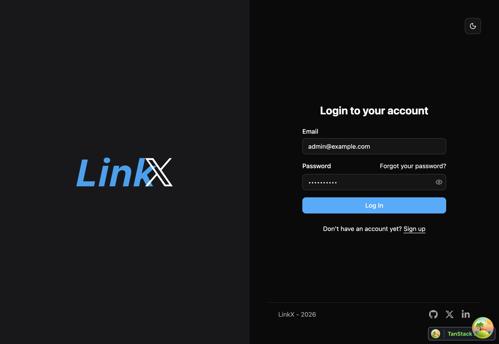

# LinkX – Open Source Social Posting & Scheduling

<a href="https://github.com/fastapi/full-stack-fastapi-template/actions?query=workflow%3A%22Test+Docker+Compose%22" target="_blank"></a>
<a href="https://github.com/fastapi/full-stack-fastapi-template/actions?query=workflow%3A%22Test+Backend%22" target="_blank"></a>
<a href="https://coverage-badge.samuelcolvin.workers.dev/redirect/fastapi/full-stack-fastapi-template" target="_blank"></a>

LinkX is an **open‑source social media planner** that you can **self‑host** with Docker Compose.
It gives you a unified dashboard to draft, schedule, and publish posts across platforms while you retain full control of your data and infrastructure.

## Technology Stack and Features

- ⚡ [**FastAPI**](https://fastapi.tiangolo.com) backend API.
  - 🧰 [SQLModel](https://sqlmodel.tiangolo.com) ORM over PostgreSQL.
  - 🔍 [Pydantic](https://docs.pydantic.dev) for data validation and settings.
  - 💾 [PostgreSQL](https://www.postgresql.org) as the database.
- 🚀 [React](https://react.dev) frontend.
  - TypeScript, hooks, [Vite](https://vitejs.dev), and modern tooling.
  - 🎨 [Tailwind CSS](https://tailwindcss.com) + [shadcn/ui](https://ui.shadcn.com) components.
  - 🧪 [Playwright](https://playwright.dev) for end‑to‑end testing.
  - 🦇 Built‑in dark mode support.
- 🐋 [Docker Compose](https://www.docker.com) for local and production deployments.
- 🔒 Secure password hashing and **JWT** authentication.
- 📫 Email‑based password recovery with [Mailcatcher](https://mailcatcher.me) in development.
- ✅ Tests with [Pytest](https://pytest.org).
- 📞 [Traefik](https://traefik.io) reverse proxy / load balancer.
- 🚢 Deployment docs for running LinkX as your own self‑hosted social scheduler.
- 🏭 CI/CD workflows using GitHub Actions.

### Social Integrations (LinkX)

- **LinkedIn member posting (self‑hosted)**:
  - Connect a personal LinkedIn account and publish or delete posts directly from LinkX.
  - Uses OAuth 2.0 with scopes `openid profile email w_member_social`.
  - Tokens are stored server‑side only in your deployment; no secrets are exposed to the browser.
  - See [`docs/LINKEDIN_SETUP.md`](./docs/LINKEDIN_SETUP.md) for step‑by‑step configuration.
- **Planned**:
  - X (Twitter) integration.
  - Richer media workflows and cross‑posting, tracked in [`docs/specs/SOCIAL_MEDIA_INTEGRATION.md`](./docs/specs/SOCIAL_MEDIA_INTEGRATION.md) and related specs.

### Dashboard Login

[](https://github.com/fastapi/full-stack-fastapi-template)

### Dashboard - Admin

[](https://github.com/fastapi/full-stack-fastapi-template)

### Dashboard - Items

[](https://github.com/fastapi/full-stack-fastapi-template)

### Dashboard - Dark Mode

[](https://github.com/fastapi/full-stack-fastapi-template)

### Interactive API Documentation

[](https://github.com/fastapi/full-stack-fastapi-template)

## How To Use It

You can **just fork or clone** this repository and use it as is.

✨ It just works. ✨

### How to Use a Private Repository

If you want to have a private repository, GitHub won't allow you to simply fork it as it doesn't allow changing the visibility of forks.

But you can do the following:

- Create a new GitHub repo, for example `my-full-stack`.
- Clone this repository manually, set the name with the name of the project you want to use, for example `my-full-stack`:

```bash
git clone git@github.com:fastapi/full-stack-fastapi-template.git my-full-stack
```

- Enter into the new directory:

```bash
cd my-full-stack
```

- Set the new origin to your new repository, copy it from the GitHub interface, for example:

```bash
git remote set-url origin git@github.com:octocat/my-full-stack.git
```

- Add this repo as another "remote" to allow you to get updates later:

```bash
git remote add upstream git@github.com:fastapi/full-stack-fastapi-template.git
```

- Push the code to your new repository:

```bash
git push -u origin master
```

### Update From the Original Template

After cloning the repository, and after doing changes, you might want to get the latest changes from this original template.

- Make sure you added the original repository as a remote, you can check it with:

```bash
git remote -v

origin    git@github.com:octocat/my-full-stack.git (fetch)
origin    git@github.com:octocat/my-full-stack.git (push)
upstream    git@github.com:fastapi/full-stack-fastapi-template.git (fetch)
upstream    git@github.com:fastapi/full-stack-fastapi-template.git (push)
```

- Pull the latest changes without merging:

```bash
git pull --no-commit upstream master
```

This will download the latest changes from this template without committing them, that way you can check everything is right before committing.

- If there are conflicts, solve them in your editor.

- Once you are done, commit the changes:

```bash
git merge --continue
```

### Configure

You can then update configs in the `.env` files to customize your configurations.

Before deploying it, make sure you change at least the values for:

- `SECRET_KEY`
- `FIRST_SUPERUSER_PASSWORD`
- `POSTGRES_PASSWORD`

You can (and should) pass these as environment variables from secrets.

Read the [deployment.md](./deployment.md) docs for more details.

### Generate Secret Keys

Some environment variables in the `.env` file have a default value of `changethis`.

You have to change them with a secret key, to generate secret keys you can run the following command:

```bash
python -c "import secrets; print(secrets.token_urlsafe(32))"
```

Copy the content and use that as password / secret key. And run that again to generate another secure key.

## How To Use It - Alternative With Copier

This repository also supports generating a new project using [Copier](https://copier.readthedocs.io).

It will copy all the files, ask you configuration questions, and update the `.env` files with your answers.

### Install Copier

You can install Copier with:

```bash
pip install copier
```

Or better, if you have [`pipx`](https://pipx.pypa.io/), you can run it with:

```bash
pipx install copier
```

**Note**: If you have `pipx`, installing copier is optional, you could run it directly.

### Generate a Project With Copier

Decide a name for your new project's directory, you will use it below. For example, `my-awesome-project`.

Go to the directory that will be the parent of your project, and run the command with your project's name:

```bash
copier copy https://github.com/fastapi/full-stack-fastapi-template my-awesome-project --trust
```

If you have `pipx` and you didn't install `copier`, you can run it directly:

```bash
pipx run copier copy https://github.com/fastapi/full-stack-fastapi-template my-awesome-project --trust
```

**Note** the `--trust` option is necessary to be able to execute a [post-creation script](https://github.com/fastapi/full-stack-fastapi-template/blob/master/.copier/update_dotenv.py) that updates your `.env` files.

### Input Variables

Copier will ask you for some data, you might want to have at hand before generating the project.

But don't worry, you can just update any of that in the `.env` files afterwards.

The input variables, with their default values (some auto generated) are:

- `project_name`: (default: `"FastAPI Project"`) The name of the project, shown to API users (in .env).
- `stack_name`: (default: `"fastapi-project"`) The name of the stack used for Docker Compose labels and project name (no spaces, no periods) (in .env).
- `secret_key`: (default: `"changethis"`) The secret key for the project, used for security, stored in .env, you can generate one with the method above.
- `first_superuser`: (default: `"admin@example.com"`) The email of the first superuser (in .env).
- `first_superuser_password`: (default: `"changethis"`) The password of the first superuser (in .env).
- `smtp_host`: (default: "") The SMTP server host to send emails, you can set it later in .env.
- `smtp_user`: (default: "") The SMTP server user to send emails, you can set it later in .env.
- `smtp_password`: (default: "") The SMTP server password to send emails, you can set it later in .env.
- `emails_from_email`: (default: `"info@example.com"`) The email account to send emails from, you can set it later in .env.
- `postgres_password`: (default: `"changethis"`) The password for the PostgreSQL database, stored in .env, you can generate one with the method above.
- `sentry_dsn`: (default: "") The DSN for Sentry, if you are using it, you can set it later in .env.

## Backend Development

Backend docs: [backend/README.md](./backend/README.md).

## Frontend Development

Frontend docs: [frontend/README.md](./frontend/README.md).

## Deployment

Deployment docs: [deployment.md](./deployment.md).

## Development

General development docs: [development.md](./development.md).

This includes using Docker Compose, custom local domains, `.env` configurations, etc.

## Release Notes

Check the file [release-notes.md](./release-notes.md).

## Sibling project generators

* Based on Couchbase: [https://github.com/tiangolo/full-stack-fastapi-couchbase](https://github.com/tiangolo/full-stack-fastapi-couchbase).

## Release Notes

### Latest Changes

* ⬆ Bump tiangolo/issue-manager from 0.2.0 to 0.5.0. PR [#591](https://github.com/tiangolo/full-stack-fastapi-postgresql/pull/591) by [@dependabot[bot]](https://github.com/apps/dependabot).
* ✨ Upgrade items router with new SQLModel models, simplified logic, and new FastAPI Annotated dependencies. PR [#560](https://github.com/tiangolo/full-stack-fastapi-postgresql/pull/560) by [@tiangolo](https://github.com/tiangolo).
* ✨ Adopt SQLModel, create models, start using it. PR [#559](https://github.com/tiangolo/full-stack-fastapi-postgresql/pull/559) by [@tiangolo](https://github.com/tiangolo).
* ⬆️ Upgrade Python version and dependencies. PR [#558](https://github.com/tiangolo/full-stack-fastapi-postgresql/pull/558) by [@tiangolo](https://github.com/tiangolo).
* 🔧 Add missing dotenv variables. PR [#554](https://github.com/tiangolo/full-stack-fastapi-postgresql/pull/554) by [@tiangolo](https://github.com/tiangolo).

#### Features

* ✨ Add state store to new frontend. PR [#592](https://github.com/tiangolo/full-stack-fastapi-postgresql/pull/592) by [@alejsdev](https://github.com/alejsdev).
* ✨ Add form validation to Admin, Items and Login. PR [#616](https://github.com/tiangolo/full-stack-fastapi-postgresql/pull/616) by [@alejsdev](https://github.com/alejsdev).
* ✨ Add Sidebar to new frontend. PR [#587](https://github.com/tiangolo/full-stack-fastapi-postgresql/pull/587) by [@alejsdev](https://github.com/alejsdev).
* ✨ Add Login to new frontend. PR [#585](https://github.com/tiangolo/full-stack-fastapi-postgresql/pull/585) by [@alejsdev](https://github.com/alejsdev).
* ✨ Include schemas in generated frontend client. PR [#584](https://github.com/tiangolo/full-stack-fastapi-postgresql/pull/584) by [@alejsdev](https://github.com/alejsdev).
* ✨ Regenerate frontend client with recent changes. PR [#575](https://github.com/tiangolo/full-stack-fastapi-postgresql/pull/575) by [@alejsdev](https://github.com/alejsdev).
* ♻️ Refactor API in `utils.py`. PR [#573](https://github.com/tiangolo/full-stack-fastapi-postgresql/pull/573) by [@alejsdev](https://github.com/alejsdev).
* ✨ Update code for login API. PR [#571](https://github.com/tiangolo/full-stack-fastapi-postgresql/pull/571) by [@tiangolo](https://github.com/tiangolo).
* ✨ Add client in frontend and client generation. PR [#569](https://github.com/tiangolo/full-stack-fastapi-postgresql/pull/569) by [@alejsdev](https://github.com/alejsdev).
* 🐳 Set up Docker config for new-frontend. PR [#564](https://github.com/tiangolo/full-stack-fastapi-postgresql/pull/564) by [@alejsdev](https://github.com/alejsdev).
* ✨ Set up new frontend with Vite, TypeScript and React. PR [#563](https://github.com/tiangolo/full-stack-fastapi-postgresql/pull/563) by [@alejsdev](https://github.com/alejsdev).
* 📌 Add NodeJS version management and instructions. PR [#551](https://github.com/tiangolo/full-stack-fastapi-postgresql/pull/551) by [@alejsdev](https://github.com/alejsdev).
* Add consistent errors for env vars not set. PR [#200](https://github.com/tiangolo/full-stack-fastapi-postgresql/pull/200).
* Upgrade Traefik to version 2, keeping in sync with DockerSwarm.rocks. PR [#199](https://github.com/tiangolo/full-stack-fastapi-postgresql/pull/199).
* Run tests with `TestClient`. PR [#160](https://github.com/tiangolo/full-stack-fastapi-postgresql/pull/160).

#### Fixes

* 🐛  Add `onClose` to `SidebarItems`. PR [#589](https://github.com/tiangolo/full-stack-fastapi-postgresql/pull/589) by [@alejsdev](https://github.com/alejsdev).
* 🐛 Fix positional argument bug in `init_db.py`. PR [#562](https://github.com/tiangolo/full-stack-fastapi-postgresql/pull/562) by [@alejsdev](https://github.com/alejsdev).
* 📌 Fix flower Docker image, pin version. PR [#396](https://github.com/tiangolo/full-stack-fastapi-postgresql/pull/396) by [@sanggusti](https://github.com/sanggusti).
* 🐛 Fix Celery worker command. PR [#443](https://github.com/tiangolo/full-stack-fastapi-postgresql/pull/443) by [@bechtold](https://github.com/bechtold).
* 🐛 Fix Poetry installation in Dockerfile and upgrade Python version and packages to fix Docker build. PR [#480](https://github.com/tiangolo/full-stack-fastapi-postgresql/pull/480) by [@little7Li](https://github.com/little7Li).

#### Refactors

* ✨ Add Layout to App. PR [#588](https://github.com/tiangolo/full-stack-fastapi-postgresql/pull/588) by [@alejsdev](https://github.com/alejsdev).
* ♻️ Re-enable user update path operations for frontend client generation. PR [#574](https://github.com/tiangolo/full-stack-fastapi-postgresql/pull/574) by [@alejsdev](https://github.com/alejsdev).
* ♻️ Remove type ignores and add `response_model`. PR [#572](https://github.com/tiangolo/full-stack-fastapi-postgresql/pull/572) by [@alejsdev](https://github.com/alejsdev).
* ♻️ Refactor Users API and dependencies. PR [#561](https://github.com/tiangolo/full-stack-fastapi-postgresql/pull/561) by [@alejsdev](https://github.com/alejsdev).
* ♻️ Refactor frontend Docker build setup, use plain NodeJS, use custom Nginx config, fix build for old Vue. PR [#555](https://github.com/tiangolo/full-stack-fastapi-postgresql/pull/555) by [@tiangolo](https://github.com/tiangolo).
* ♻️ Refactor project generation, discard cookiecutter, use plain git/clone/fork. PR [#553](https://github.com/tiangolo/full-stack-fastapi-postgresql/pull/553) by [@tiangolo](https://github.com/tiangolo).
* Refactor backend:
    * Simplify configs for tools and format to better support editor integration.
    * Add mypy configurations and plugins.
    * Add types to all the codebase.
    * Update types for SQLAlchemy models with plugin.
    * Update and refactor CRUD utils.
    * Refactor DB sessions to use dependencies with `yield`.
    * Refactor dependencies, security, CRUD, models, schemas, etc. To simplify code and improve autocompletion.
    * Change from PyJWT to Python-JOSE as it supports additional use cases.
    * Fix JWT tokens using user email/ID as the subject in `sub`.
    * PR [#158](https://github.com/tiangolo/full-stack-fastapi-postgresql/pull/158).
* Simplify `docker-compose.*.yml` files, refactor deployment to reduce config files. PR [#153](https://github.com/tiangolo/full-stack-fastapi-postgresql/pull/153).
* Simplify env var files, merge to a single `.env` file. PR [#151](https://github.com/tiangolo/full-stack-fastapi-postgresql/pull/151).

#### Docs

* 📝 Update README with in construction notice. PR [#552](https://github.com/tiangolo/full-stack-fastapi-postgresql/pull/552) by [@tiangolo](https://github.com/tiangolo).
* Add docs about reporting test coverage in HTML. PR [#161](https://github.com/tiangolo/full-stack-fastapi-postgresql/pull/161).
* Add docs about removing the frontend, for an API-only app. PR [#156](https://github.com/tiangolo/full-stack-fastapi-postgresql/pull/156).

#### Internal

* 👷 Add dependabot. PR [#547](https://github.com/tiangolo/full-stack-fastapi-postgresql/pull/547) by [@tiangolo](https://github.com/tiangolo).
* 👷 Fix latest-changes GitHub Action token, strike 2. PR [#546](https://github.com/tiangolo/full-stack-fastapi-postgresql/pull/546) by [@tiangolo](https://github.com/tiangolo).
* 👷 Fix latest-changes GitHub Action token config. PR [#545](https://github.com/tiangolo/full-stack-fastapi-postgresql/pull/545) by [@tiangolo](https://github.com/tiangolo).
* 👷 Add latest-changes GitHub Action. PR [#544](https://github.com/tiangolo/full-stack-fastapi-postgresql/pull/544) by [@tiangolo](https://github.com/tiangolo).
* Update issue-manager. PR [#211](https://github.com/tiangolo/full-stack-fastapi-postgresql/pull/211).
* Add [GitHub Sponsors](https://github.com/sponsors/tiangolo) button. PR [#201](https://github.com/tiangolo/full-stack-fastapi-postgresql/pull/201).
* Simplify scripts and development, update docs and configs. PR [#155](https://github.com/tiangolo/full-stack-fastapi-postgresql/pull/155).

### 0.5.0

* Make the Traefik public network a fixed default of `traefik-public` as done in DockerSwarm.rocks, to simplify development and iteration of the project generator. PR [#150](https://github.com/tiangolo/full-stack-fastapi-postgresql/pull/150).
* Update to PostgreSQL 12. PR [#148](https://github.com/tiangolo/full-stack-fastapi-postgresql/pull/148). by [@RCheese](https://github.com/RCheese).
* Use Poetry for package management. Initial PR [#144](https://github.com/tiangolo/full-stack-fastapi-postgresql/pull/144) by [@RCheese](https://github.com/RCheese).
* Fix Windows line endings for shell scripts after project generation with Cookiecutter hooks. PR [#149](https://github.com/tiangolo/full-stack-fastapi-postgresql/pull/149).
* Upgrade Vue CLI to version 4. PR [#120](https://github.com/tiangolo/full-stack-fastapi-postgresql/pull/120) by [@br3ndonland](https://github.com/br3ndonland).
* Remove duplicate `login` tag. PR [#135](https://github.com/tiangolo/full-stack-fastapi-postgresql/pull/135) by [@Nonameentered](https://github.com/Nonameentered).
* Fix showing email in dashboard when there's no user's full name. PR [#129](https://github.com/tiangolo/full-stack-fastapi-postgresql/pull/129) by [@rlonka](https://github.com/rlonka).
* Format code with Black and Flake8. PR [#121](https://github.com/tiangolo/full-stack-fastapi-postgresql/pull/121) by [@br3ndonland](https://github.com/br3ndonland).
* Simplify SQLAlchemy Base class. PR [#117](https://github.com/tiangolo/full-stack-fastapi-postgresql/pull/117) by [@airibarne](https://github.com/airibarne).
* Update CRUD utils for users, handling password hashing. PR [#106](https://github.com/tiangolo/full-stack-fastapi-postgresql/pull/106) by [@mocsar](https://github.com/mocsar).
* Use `.` instead of `source` for interoperability. PR [#98](https://github.com/tiangolo/full-stack-fastapi-postgresql/pull/98) by [@gucharbon](https://github.com/gucharbon).
* Use Pydantic's `BaseSettings` for settings/configs and env vars. PR [#87](https://github.com/tiangolo/full-stack-fastapi-postgresql/pull/87) by [@StephenBrown2](https://github.com/StephenBrown2).
* Remove `package-lock.json` to let everyone lock their own versions (depending on OS, etc).
* Simplify Traefik service labels PR [#139](https://github.com/tiangolo/full-stack-fastapi-postgresql/pull/139).
* Add email validation. PR [#40](https://github.com/tiangolo/full-stack-fastapi-postgresql/pull/40) by [@kedod](https://github.com/kedod).
* Fix typo in README. PR [#83](https://github.com/tiangolo/full-stack-fastapi-postgresql/pull/83) by [@ashears](https://github.com/ashears).
* Fix typo in README. PR [#80](https://github.com/tiangolo/full-stack-fastapi-postgresql/pull/80) by [@abjoker](https://github.com/abjoker).
* Fix function name `read_item` and response code. PR [#74](https://github.com/tiangolo/full-stack-fastapi-postgresql/pull/74) by [@jcaguirre89](https://github.com/jcaguirre89).
* Fix typo in comment. PR [#70](https://github.com/tiangolo/full-stack-fastapi-postgresql/pull/70) by [@daniel-butler](https://github.com/daniel-butler).
* Fix Flower Docker configuration. PR [#37](https://github.com/tiangolo/full-stack-fastapi-postgresql/pull/37) by [@dmontagu](https://github.com/dmontagu).
* Add new CRUD utils based on DB and Pydantic models. Initial PR [#23](https://github.com/tiangolo/full-stack-fastapi-postgresql/pull/23) by [@ebreton](https://github.com/ebreton).
* Add normal user testing Pytest fixture. PR [#20](https://github.com/tiangolo/full-stack-fastapi-postgresql/pull/20) by [@ebreton](https://github.com/ebreton).

### 0.4.0

* Fix security on resetting a password. Receive token as body, not query. PR [#34](https://github.com/tiangolo/full-stack-fastapi-postgresql/pull/34).

* Fix security on resetting a password. Receive it as body, not query. PR [#33](https://github.com/tiangolo/full-stack-fastapi-postgresql/pull/33) by [@dmontagu](https://github.com/dmontagu).

* Fix SQLAlchemy class lookup on initialization. PR [#29](https://github.com/tiangolo/full-stack-fastapi-postgresql/pull/29) by [@ebreton](https://github.com/ebreton).

* Fix SQLAlchemy operation errors on database restart. PR [#32](https://github.com/tiangolo/full-stack-fastapi-postgresql/pull/32) by [@ebreton](https://github.com/ebreton).

* Fix locations of scripts in generated README. PR [#19](https://github.com/tiangolo/full-stack-fastapi-postgresql/pull/19) by [@ebreton](https://github.com/ebreton).

* Forward arguments from script to `pytest` inside container. PR [#17](https://github.com/tiangolo/full-stack-fastapi-postgresql/pull/17) by [@ebreton](https://github.com/ebreton).

* Update development scripts.

* Read Alembic configs from env vars. PR <a href="https://github.com/tiangolo/full-stack-fastapi-postgresql/pull/9" target="_blank">#9</a> by <a href="https://github.com/ebreton" target="_blank">@ebreton</a>.

* Create DB Item objects from all Pydantic model's fields.

* Update Jupyter Lab installation and util script/environment variable for local development.

### 0.3.0

* PR <a href="https://github.com/tiangolo/full-stack-fastapi-postgresql/pull/14" target="_blank">#14</a>:
    * Update CRUD utils to use types better.
    * Simplify Pydantic model names, from `UserInCreate` to `UserCreate`, etc.
    * Upgrade packages.
    * Add new generic "Items" models, crud utils, endpoints, and tests. To facilitate re-using them to create new functionality. As they are simple and generic (not like Users), it's easier to copy-paste and adapt them to each use case.
    * Update endpoints/*path operations* to simplify code and use new utilities, prefix and tags in `include_router`.
    * Update testing utils.
    * Update linting rules, relax vulture to reduce false positives.
    * Update migrations to include new Items.
    * Update project README.md with tips about how to start with backend.

* Upgrade Python to 3.7 as Celery is now compatible too. PR <a href="https://github.com/tiangolo/full-stack-fastapi-postgresql/pull/10" target="_blank">#10</a> by <a href="https://github.com/ebreton" target="_blank">@ebreton</a>.

### 0.2.2

* Fix frontend hijacking /docs in development. Using latest https://github.com/tiangolo/node-frontend with custom Nginx configs in frontend. <a href="https://github.com/tiangolo/full-stack-fastapi-postgresql/pull/6" target="_blank">PR #6</a>.

### 0.2.1

* Fix documentation for *path operation* to get user by ID. <a href="https://github.com/tiangolo/full-stack-fastapi-postgresql/pull/4" target="_blank">PR #4</a> by <a href="https://github.com/mpclarkson" target="_blank">@mpclarkson</a> in FastAPI.

* Set `/start-reload.sh` as a command override for development by default.

* Update generated README.

### 0.2.0

**<a href="https://github.com/tiangolo/full-stack-fastapi-postgresql/pull/2" target="_blank">PR #2</a>**:

* Simplify and update backend `Dockerfile`s.
* Refactor and simplify backend code, improve naming, imports, modules and "namespaces".
* Improve and simplify Vuex integration with TypeScript accessors.
* Standardize frontend components layout, buttons order, etc.
* Add local development scripts (to develop this project generator itself).
* Add logs to startup modules to detect errors early.
* Improve FastAPI dependency utilities, to simplify and reduce code (to require a superuser).

### 0.1.2

* Fix path operation to update self-user, set parameters as body payload.

### 0.1.1

Several bug fixes since initial publication, including:

* Order of path operations for users.
* Frontend sending login data in the correct format.
* Add https://localhost variants to CORS.

## License

The Full Stack FastAPI Template is licensed under the terms of the MIT license.
