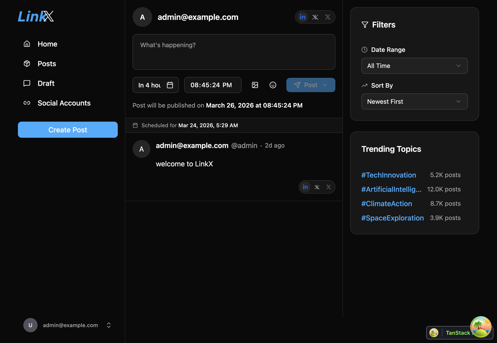
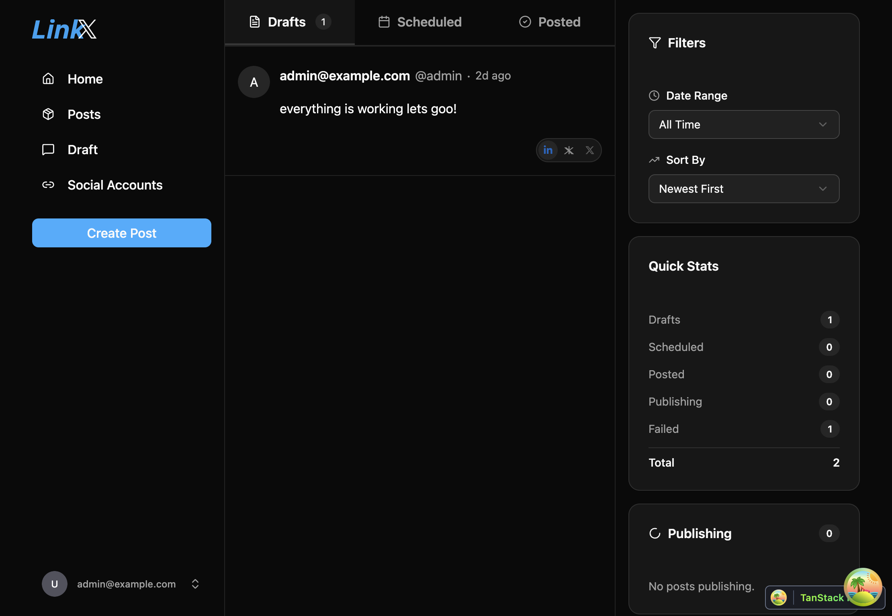
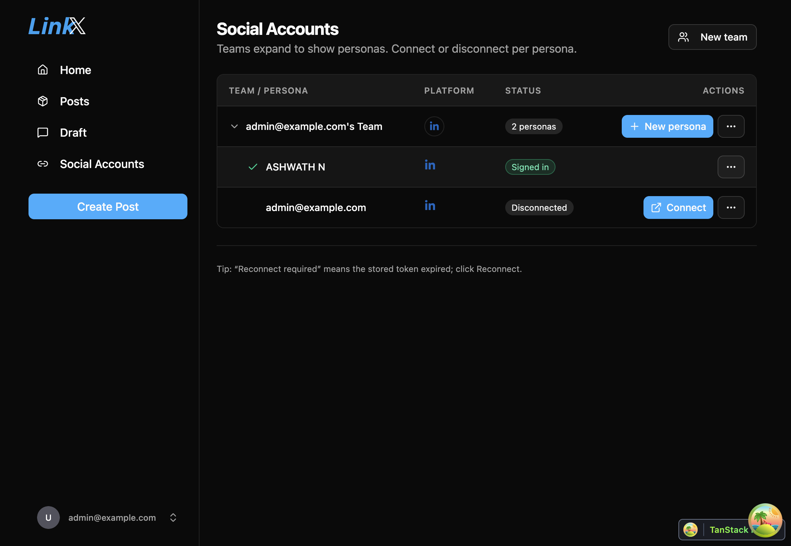

# LinkX – Open Source Social Posting & Scheduling

[](./LICENSE)
[](https://github.com/sponsors/AchuAshwath)

LinkX is an **open‑source social media planner** that you can **self‑host** with Docker Compose.
It gives you a unified dashboard to draft, schedule, and publish posts across platforms while you retain full control of your data and infrastructure.

## Technology Stack and Features

- ⚡ [**FastAPI**](https://fastapi.tiangolo.com) backend API.
  - 🧰 [SQLModel](https://sqlmodel.tiangolo.com) ORM over PostgreSQL.
  - 🔍 [Pydantic](https://docs.pydantic.dev) for data validation and settings.
  - 💾 [PostgreSQL](https://www.postgresql.org) as the database.
- 🚀 [React](https://react.dev) frontend.
  - TypeScript, hooks, [Vite](https://vitejs.dev), and modern tooling.
  - 🎨 [Tailwind CSS](https://tailwindcss.com) + [shadcn/ui](https://ui.shadcn.com) components.
  - 🧪 [Playwright](https://playwright.dev) for end‑to‑end testing.
  - 🦇 Built‑in dark mode support.
- 🐋 [Docker Compose](https://www.docker.com) for local and production deployments.
- 🔒 Secure password hashing and **JWT** authentication.
- 📫 Email‑based password recovery with [Mailcatcher](https://mailcatcher.me) in development.
- ✅ Tests with [Pytest](https://pytest.org).
- 📞 [Traefik](https://traefik.io) reverse proxy / load balancer (optional layouts).
- 🚢 Deployment docs for running LinkX as your own self‑hosted social scheduler.

### Social Integrations (LinkX)

- **LinkedIn member posting (self‑hosted)**:
  - Connect a personal LinkedIn account and publish or delete posts directly from LinkX.
  - Uses OAuth 2.0 with scopes `openid profile email w_member_social`.
  - Tokens are stored server‑side only in your deployment; no secrets are exposed to the browser.
  - See [`docs/LINKEDIN_SETUP.md`](./docs/LINKEDIN_SETUP.md) for step‑by‑step configuration.
- **Planned**:
  - X (Twitter) integration.
  - Richer media workflows and cross‑posting, tracked in [`docs/specs/SOCIAL_MEDIA_INTEGRATION.md`](./docs/specs/SOCIAL_MEDIA_INTEGRATION.md) and related specs.

### Screenshots

Captured from the app running locally (`bun run dev` in `frontend/`, dark theme): sign-in, home timeline, posts, and social personas.

<p align="center">
  
  
</p>
<p align="center">
  
  
</p>

## Quick start

```bash
git clone git@github.com:AchuAshwath/LinkX.git
cd LinkX
# Create and edit `.env` at the repo root (see development.md / deployment.md).
```

Typical local setup (see [`AGENTS.md`](./AGENTS.md) and [`development.md`](./development.md) for details):

- **Option A: Lightweight Hybrid Setup (Recommended)**
  Runs database & redis in Docker, but runs the frontend & backend code natively on the host. Fast hot-reloading and low memory/storage footprint.
  ```bash
  # 1. Create your local override configuration (.env.local is gitignored)
  echo -e "POSTGRES_SERVER=localhost\nREDIS_URL=redis://localhost:6379/0" > .env.local

  # 2. Spin up databases and launch both local dev servers
  bun run dev:local
  ```

- **Option B: Full Docker Setup**
  Runs all services inside Docker Compose (includes watch mode for live sync).
  ```bash
  docker compose watch
  ```

Configure secrets in `.env` (`SECRET_KEY`, `FIRST_SUPERUSER_PASSWORD`, `POSTGRES_PASSWORD`, etc.) before a real deployment.

### Generate secret keys

```bash
python -c "import secrets; print(secrets.token_urlsafe(32))"
```

## Documentation

| Topic | Location |
|--------|----------|
| Backend | [`backend/README.md`](./backend/README.md) |
| Frontend | [`frontend/README.md`](./frontend/README.md) |
| Deployment | [`deployment.md`](./deployment.md) |
| Local dev & tooling | [`development.md`](./development.md) |
| Agent / AI guidelines | [`AGENTS.md`](./AGENTS.md) |

Longer template-derived release notes (historical) live in [`release-notes.md`](./release-notes.md).

## Sponsor

If LinkX is useful to you, sponsorship helps maintain and grow the project:

**[github.com/sponsors/AchuAshwath](https://github.com/sponsors/AchuAshwath)**

The **Sponsor** button on this repository is configured via [`.github/FUNDING.yml`](./.github/FUNDING.yml).

## Acknowledgments

LinkX builds on patterns and code from the [FastAPI full-stack template](https://github.com/fastapi/full-stack-fastapi-template) and related ecosystem projects (MIT License). LinkX-specific features (personas, teams, LinkedIn integration, and social UI) are developed in this repository.

## License

See [`LICENSE`](./LICENSE) (MIT).
