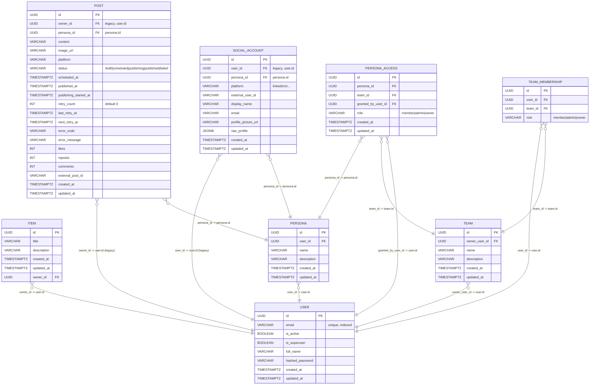
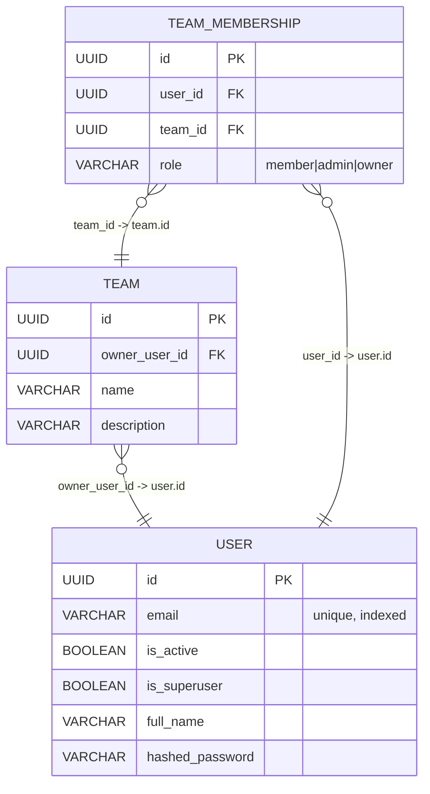
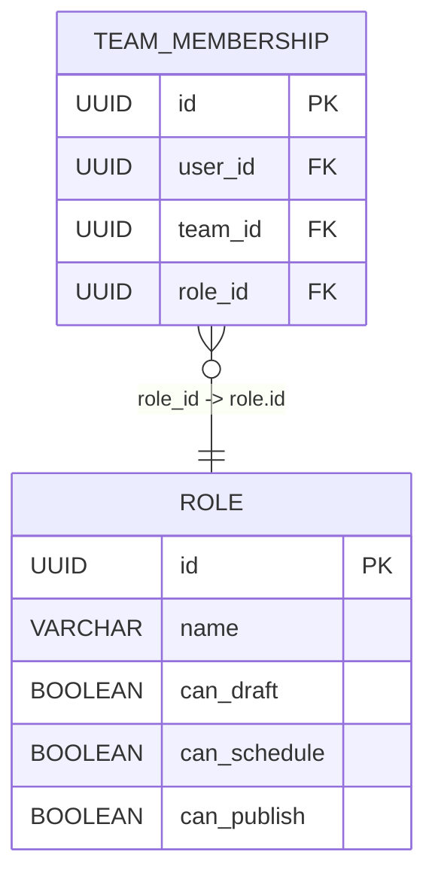
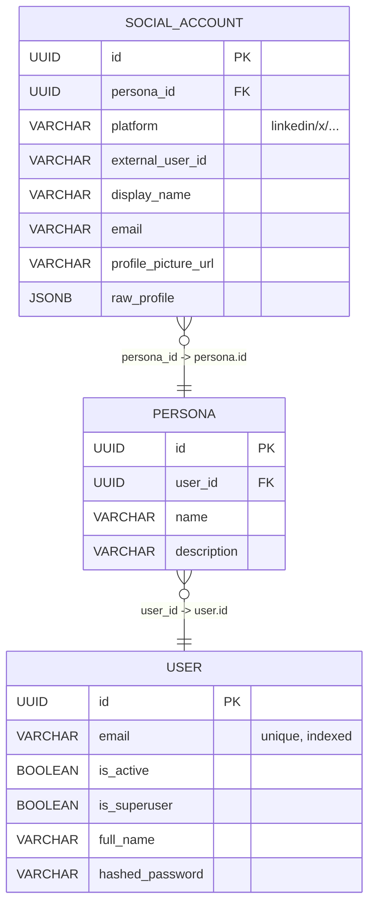
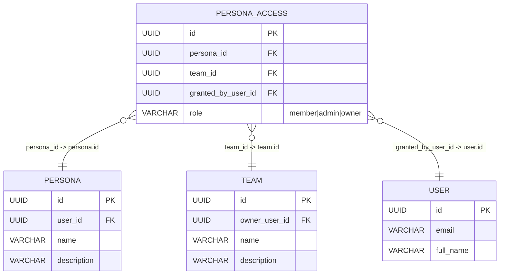
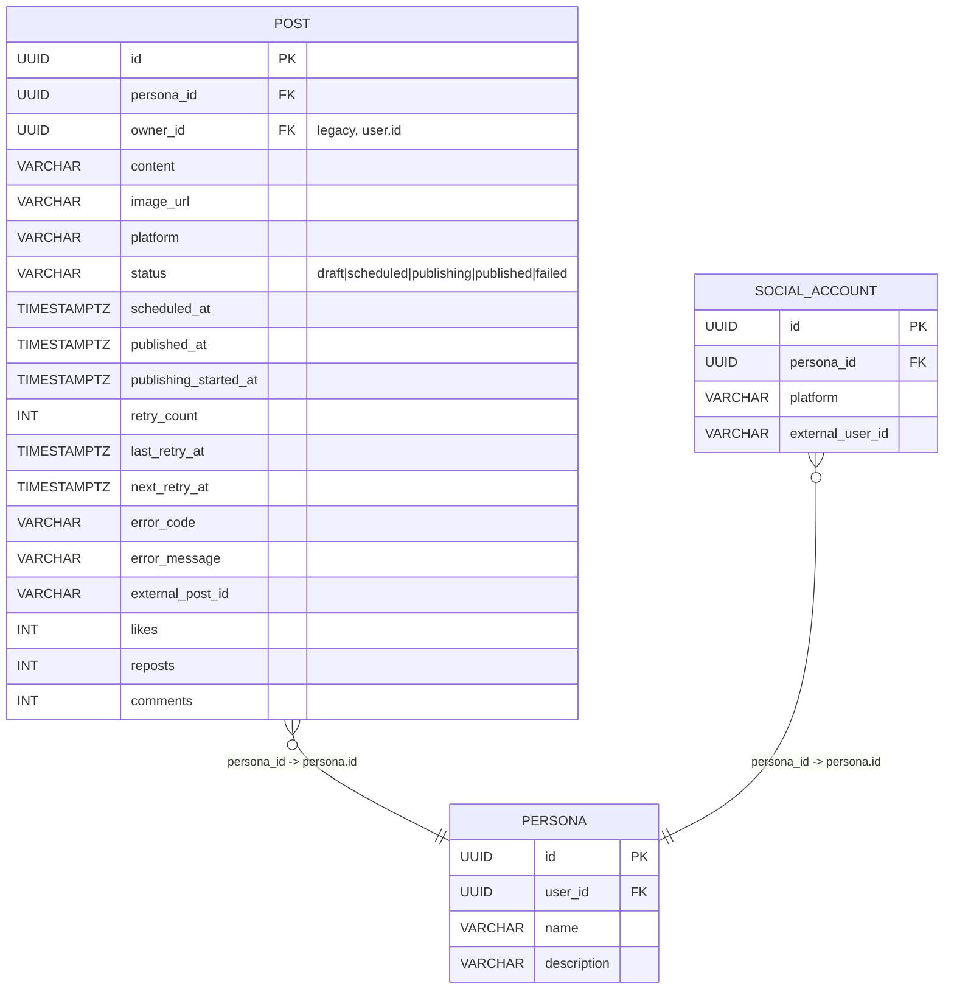

Generic single-database configuration.

## Full conceptual ER diagram (current design)



## Users and teams

This section focuses on how users, teams, and team membership relate.

### Current conceptual model



- A **user** can belong to many teams through `TEAM_MEMBERSHIP`.
- A **team** can have many users.
- The **join table** `TEAM_MEMBERSHIP` is how you represent:
  - "list of teams for a user" (all rows with that `user_id`)
  - "list of users for a team" (all rows with that `team_id`)

### Extensible: richer roles per team (future)

You can later turn simple string roles into a full role system by introducing a `ROLE` dimension and pointing `TEAM_MEMBERSHIP` at it:



This keeps the base `USER` and `TEAM` tables unchanged while allowing you to evolve permissions over time.

## Personas and social accounts

This section focuses on how a user owns personas, and how each persona is connected to social accounts.

### Current conceptual model



- A **user** can own many **personas**.
- Each **persona** can have at most one social account per platform (enforced with a unique index on `(persona_id, platform)`).
- `SOCIAL_ACCOUNT` stores platform-specific details (profile metadata, external IDs, etc.).

### Extensible: persona access via teams (current Phase 1)

As of Phase 1, personas are shared with teams using role-based access:



This allows:

- Personas to be shared with teams using explicit role grants.
- Team members to inherit persona access via `PERSONA_ACCESS` with their effective role.
- Persona owner can grant/revoke team-level access without direct user grants (v1).

## Posts and scheduling reliability

This section focuses on how posts relate to personas and the state machine for scheduling/publishing.

### Current conceptual model (Phase 3)



- Each **post** belongs to exactly one **persona**.
- Posts track their **status** through the state machine: `draft` → `scheduled` → `publishing` → `published` or `failed`.
- Retry fields (`retry_count`, `last_retry_at`, `next_retry_at`, `error_code`, `error_message`) support automatic retry with exponential backoff.
- `publishing_started_at` tracks when a publish attempt began.
- `external_post_id` ensures idempotent publishing (no duplicates if scheduler runs twice).
- `owner_id` is retained as legacy storage for backwards compatibility; `persona_id` is the primary ownership boundary.

### Status transitions (Phase 3 State Machine)

```
draft
  ↓ (schedule for later)
scheduled
  ↓ (wait for scheduled time)
publishing (scheduler transitions to this before attempting publish)
  ├─ ✓ (success) → published
  └─ ✗ (error) → failed (non-retryable) OR remain scheduled (retryable, reschedule with backoff)

failed (terminal, non-retryable error)
  ↓ (manual retry only, admin/owner)
scheduled (reschedule for immediate or future retry)
```

### Retry and error handling

- **Retryable errors** (429 rate limit, 5xx server error, network timeout): Keep status `scheduled`, increment `retry_count`, set `next_retry_at = NOW + (60 * 2^retry_count)`.
- **Non-retryable errors** (401 unauthorized, 400 bad request): Set status `failed`, store `error_code` and `error_message`.
- **Max retries** (default 3): After exceeding `MAX_RETRIES`, mark as `failed` and require manual intervention.
- **Idempotency**: If `external_post_id` is already set, do not re-publish (prevents duplicates).
