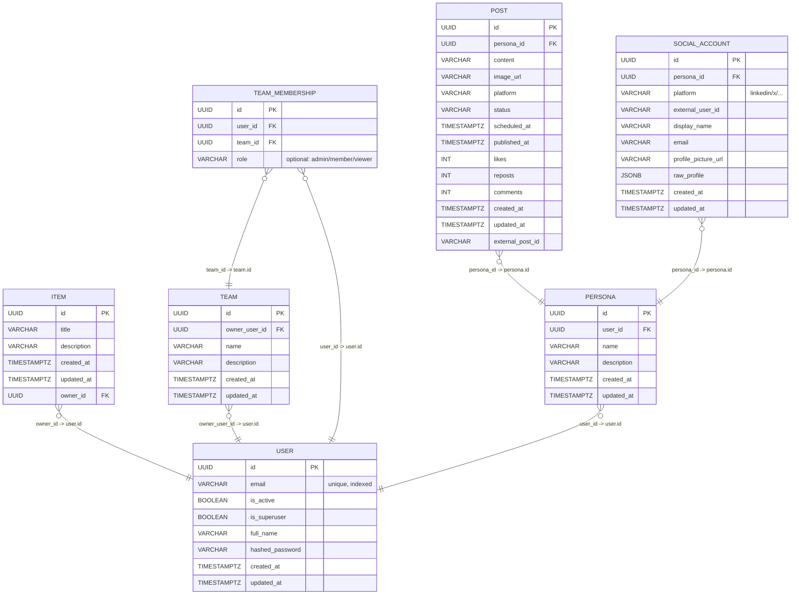
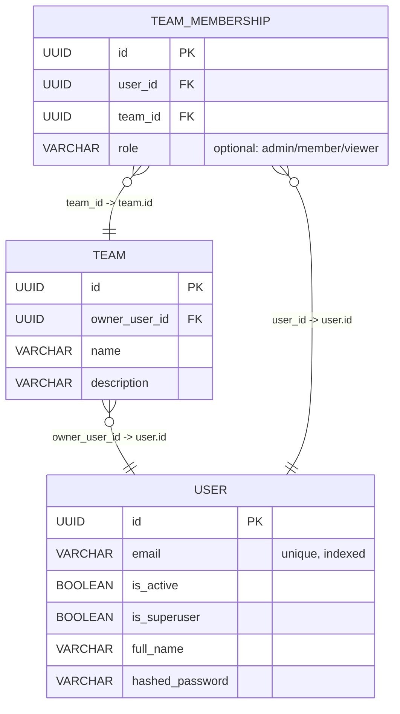
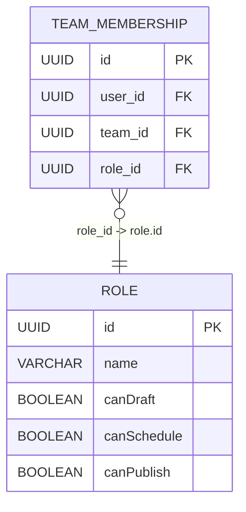
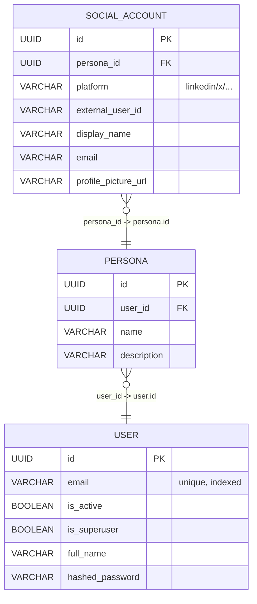
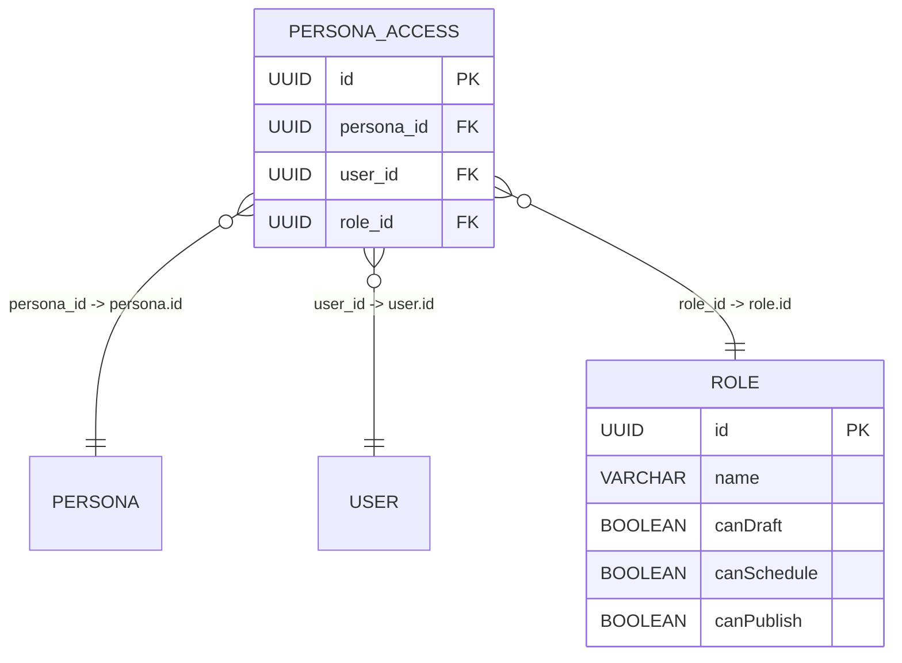

Generic single-database configuration.

## Full conceptual ER diagram (current design)

## Users and teams

This section focuses on how users, teams, and team membership relate.

### Current conceptual model

- A **user** can belong to many teams through `TEAM_MEMBERSHIP`.
- A **team** can have many users.
- The **join table** `TEAM_MEMBERSHIP` is how you represent:
  - "list of teams for a user" (all rows with that `user_id`)
  - "list of users for a team" (all rows with that `team_id`)

### Extensible: richer roles per team (future)

You can later turn simple string roles into a full role system by introducing a `ROLE` dimension and pointing `TEAM_MEMBERSHIP` at it:

This keeps the base `USER` and `TEAM` tables unchanged while allowing you to evolve permissions over time.

## Personas and social accounts

This section focuses on how a user owns personas, and how each persona is connected to social accounts.

### Current conceptual model

- A **user** can own many **personas**.
- Each **persona** can have at most one social account per platform (enforced later with a unique index on `(persona_id, platform)`).
- `SOCIAL_ACCOUNT` stores platform-specific details (profile metadata, external IDs, etc.).

### Extensible: persona access and roles (future)

Later, you can grant access to personas for specific users or teams using the same dim + join pattern as teams:

This allows:

- Multiple users to collaborate on the same persona with different permissions.
- Evolving your permission model without changing the core `PERSONA` or `SOCIAL_ACCOUNT` tables.
