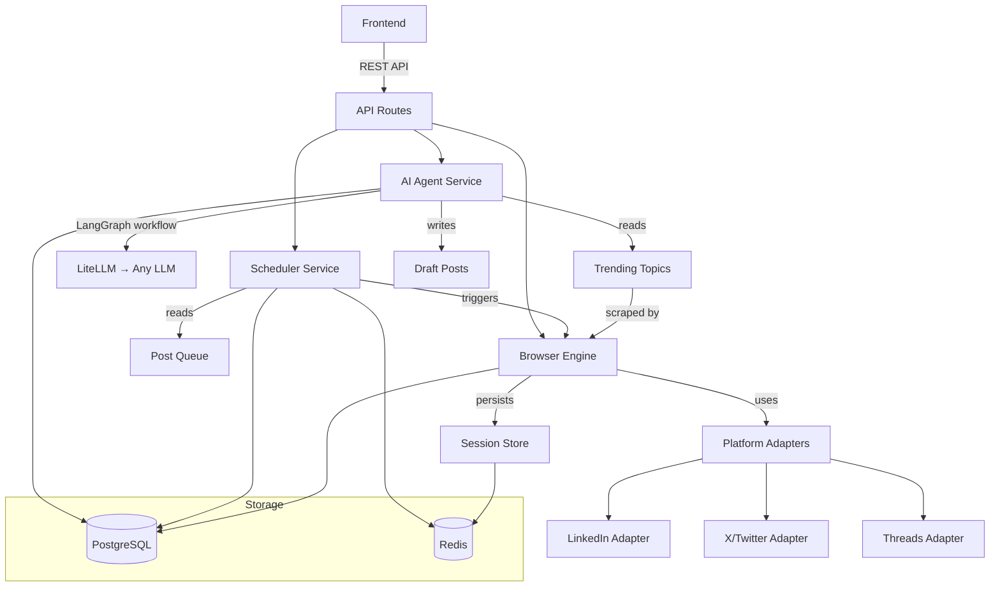

# LinkX — System Architecture

> **Status:** Draft — to be discussed and finalized

## Vision

LinkX is a research platform that implements two contrasting AI agent strategies for social media interaction — direct browser automation (System A) and screen observation (System B) — to study the jurisdictional boundaries of platform Terms of Service.

As a functional artifact, it also serves as a self‑hosted social media scheduler with AI‑powered content curation, demonstrating the complete pipeline from trend discovery to publishing.

See [`RESEARCH.md`](./RESEARCH.md) for the full thesis and [`../ETHICS.md`](../ETHICS.md) for the ethical framework.

## Tech Stack

### Backend
| Layer | Technology | Why |
|-------|-----------|-----|
| **API Framework** | FastAPI (Python) | Async, typed, existing codebase |
| **Database** | PostgreSQL | Existing, relational data |
| **Cache / Queues** | Redis | Existing, session state + job queues |
| **Browser Automation** | Playwright (Python) | System A: auth, posting, scraping — no API keys needed |
| **AI Orchestration** | LangGraph | Stateful agent workflows, human-in-the-loop |
| **AI Chains/Tools** | LangChain | Prompt chains, output parsing, tool integrations |
| **LLM Provider Layer** | LiteLLM (via `langchain-litellm`) | One interface → any LLM provider |
| **Background Jobs** | APScheduler | In-process scheduler, Redis-locked for multi-worker |
| **Migrations** | Alembic | Existing |

### Frontend
| Layer | Technology | Why |
|-------|-----------|-----|
| **Framework** | React + Vite | Existing codebase |
| **Routing** | TanStack Router (file-based) | Existing |
| **Data Fetching** | TanStack Query | Existing |
| **UI Components** | shadcn/ui + custom | Existing |

### Infrastructure
| Layer | Technology | Why |
|-------|-----------|-----|
| **Containers** | Docker Compose | Existing (Postgres, Redis, Playwright) |
| **Dev Workflow** | Hybrid: Docker services + local apps | Existing (`bun run dev:local`) |

## High-Level Architecture

```
┌─────────────────────────────────────────────────────────────────────┐
│                        React Frontend (Vite)                        │
│  Dashboard · Draft Inbox · Calendar · Brand Config · Settings       │
└───────────────────────────────────┬─────────────────────────────────┘
                                │ HTTP/REST
┌───────────────────────────────▼─────────────────────────────────────┐
│                        FastAPI Backend                               │
│                                                                      │
│  ┌──────────┐  ┌──────────────┐  ┌──────────────┐  ┌────────────┐  │
│  │ API      │  │ AI Agent     │  │ Scheduler    │  │ Browser    │  │
│  │ Routes   │  │ Service      │  │ Service      │  │ Engine     │  │
│  │          │  │              │  │              │  │            │  │
│  │ • Posts  │  │ • LangGraph  │  │ • APScheduler│  │ • Playwright│ │
│  │ • Brands │  │ • LangChain  │  │ • Job queue  │  │ • Adapters │  │
│  │ • Auth   │  │ • LiteLLM    │  │ • Retry/lock │  │ • Sessions │  │
│  │ • Admin  │  │ • Curation   │  │              │  │            │  │
│  └──────────┘  └──────────────┘  └──────────────┘  └────────────┘  │
│                                                                      │
│  ┌───────────────────┐  ┌───────────────────┐                       │
│  │ PostgreSQL        │  │ Redis             │                       │
│  │ • Users/Brands    │  │ • Browser sessions│                       │
│  │ • Posts/Drafts    │  │ • Job locks       │                       │
│  │ • Trending topics │  │ • Cache           │                       │
│  └───────────────────┘  └───────────────────┘                       │
└─────────────────────────────────────────────────────────────────────┘
```

## Component Relationships



## Key Design Decisions

| Decision | Choice | Rationale |
|----------|--------|-----------|
| Browser over APIs | Playwright headless | Research: proves System A triggers ToS "automated means" clauses regardless of evasion. Also free vs $100+/mo API costs. |
| LiteLLM over direct SDKs | `langchain-litellm` | User brings their own provider. Zero vendor lock-in. |
| LangGraph over raw chains | Stateful agent graphs | Human-in-the-loop review, complex multi-step curation workflows. |
| APScheduler over Celery | In-process scheduler | Simpler for single-instance. Redis lock for multi-worker. Celery is overkill at this stage. |
| Persona → Brand (UI only) | UI rename, keep model name | Avoids migration churn. Backend says `Persona`, frontend says `Brand`. |

## Research Architecture

The system is designed to support comparative analysis between two fundamentally different approaches to platform interaction. See [`RESEARCH.md`](./RESEARCH.md) for the full thesis.

### System A: Browser Automation (Implemented)

The control case. Operates *within* the platform's technical boundary.

- Playwright controls browser DOM directly via `rebrowser-playwright` (CDP stealth)
- `EvasionMouse` for humanized behavioral patterns (Bézier curves, idle wiggle, typing jitter)
- Persistent sessions via cookie / localStorage / IndexedDB reuse
- 3‑tier self‑healing: hardcoded selectors → AI agent fallback → human alert
- **Conclusion:** Violates ToS "automated means" clauses regardless of evasion sophistication

### System B: Screen Observation (Planning / Ideation)

The experimental case. Operates *outside* the platform's technical boundary.

- Screen capture via native OS tools (macOS `screencapture`, HDMI capture, OBS)
- Vision‑Language Model analyzes captured frames — never touches the DOM
- Content drafted in an isolated staging area (text editor or LinkX dashboard)
- Human‑in‑the‑loop for final posting action
- **Conclusion:** No ToS clause covers observation of rendered pixels on a user's own device

Architecture spec to be written — see [`ROADMAP.md`](./ROADMAP.md) Phase 2.

## Open Decisions

- [ ] Should the Playwright browser run in the same container as FastAPI, or a separate one?
- [ ] How to handle platforms that require 2FA during browser login?
- [ ] Should we support image/media posts from day 1, or text-only first?
- [ ] Where to store browser session data — Redis, encrypted files, or Postgres?
