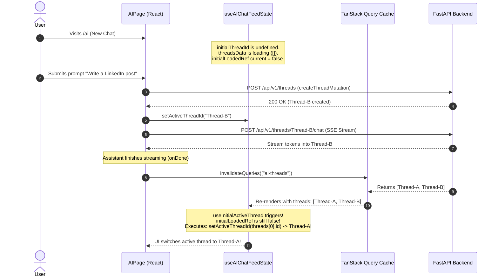

# Research Report: Agentic Harness Architecture & Session State Management

**Author**: LinkX Core Architecture & AI Systems Team
**Date**: September 5, 2026
**Status**: Technical Investigation & Architectural Recommendations
**References**: `earendil-works/pi` (Pi Agent Harness), OpenAI Codex CLI / App Server Protocol, Anthropic Claude Code Harness

---

## 1. Executive Summary & Context

As LinkX expands its agentic capabilities (social media research, web scraping, multi-turn drafting, human-in-the-loop tool calling), user interactions demand more sophisticated harness behaviors:
1. **Message Editing & Branching**: Modifying a previous prompt without destructively losing past conversation turns.
2. **Turn Retries & Regeneration**: Re-executing an assistant response when a tool fails or the generated output needs adjustment.
3. **Session State Synchronization**: Eliminating race conditions between optimistic client cache (TanStack React Query) and server-side transcript persistence.
4. **Context Budgeting & Compaction**: Ensuring long-running multi-turn sessions remain within model token limits without losing critical persona or background instructions.

This research investigates how frontier CLI coding harnesses—specifically **Pi (`earendil-works/pi`)** and **OpenAI Codex CLI / App Server**—architect session trees, context compaction, state synchronization, and tool cancellation. We evaluate whether LinkX's current implementation follows good engineering practices, determine where our architecture falls short, and outline what we should adopt versus what is unnecessary overhead.

---

## 2. Benchmark Analysis: How Frontier Agent Harnesses Work

### 2.1 The Pi Agent Harness (`earendil-works/pi`)

Pi is an open-source, minimalist AI agent harness created by Mario Zechner (now maintained by Earendil Works). Despite its tiny footprint (core tools: `read`, `write`, `edit`, `bash`), Pi implements an advanced session management system.

#### Key Architectural Patterns in Pi:
1. **Tree-Structured Session History (DAG)**:
   - Pi does **not** store messages in a flat linear list (`[m1, m2, m3]`).
   - Every message in Pi's JSONL session log contains an `id` and a `parentId`:
     ```json
     {"id": "msg_0", "parentId": null, "role": "system", "content": "You are Pi..."}
     {"id": "msg_1", "parentId": "msg_0", "role": "user", "content": "Write a script"}
     {"id": "msg_2", "parentId": "msg_1", "role": "assistant", "content": "Here is..."}
     {"id": "msg_3", "parentId": "msg_0", "role": "user", "content": "Write a Python script instead"}
     ```
2. **Non-Destructive Branching (`/tree`)**:
   - In Pi, "editing" a user message or "retrying" an assistant turn does **not** delete or mutate historical records.
   - When the user navigates backward using `/tree` or `/undo` and submits a new or modified prompt, Pi creates a new child node branching from that point.
   - The user can switch branches at will (`Ctrl+Left/Right`), exploring alternate agent trajectories while retaining all historical outputs.
3. **Decoupled RPC / Head-Pointer Model**:
   - The harness maintains a pointer to `currentLeafId`. The active conversation sent to the LLM is simply the path from `currentLeafId` walking upward via `parentId` links to the root.
   - Frontends (TUI, Web, or IDE extensions via RPC) do not manage separate conversational state; they render whichever branch the harness points to.

---

### 2.2 The OpenAI Codex CLI & App Server Protocol

OpenAI's Codex CLI and its underlying **Codex App Server protocol** power autonomous agent sessions across CLI, IDE, and cloud web environments.

#### Key Architectural Patterns in Codex:
1. **Unified Agent Loop**:
   - Operates over an asynchronous JSON-RPC protocol. The client sends user turns; the harness runs the loop: `LLM -> Tool Execution -> Append Output -> LLM -> Stop/Yield`.
2. **Dynamic Context Auto-Compaction**:
   - When prompt tokens exceed a high-water mark (e.g. 80-90% of the model's context window), the harness triggers **auto-compaction**.
   - Instead of abruptly dropping turns, the harness:
     1. Summarizes the conversational history up to turn $K$.
     2. Discards raw tool output bodies from completed tools (retaining only the tool name, status, and concise outcome).
     3. Replaces turns $1 \dots K$ with a single condensed `SystemMessage` summary block.
3. **Strict Seatbelts & Cancellation Markers**:
   - When an execution is cancelled by the user, the harness intercepts the signal, immediately flags any in-flight sub-agent or tool process with a `cancelled` state, commits the partial output to the journal, and releases workspace file locks.

---

## 3. LinkX Current State vs. Frontier Harnesses

| Dimension | LinkX (Current) | Pi Agent Harness | OpenAI Codex CLI | Assessment for LinkX |
|---|---|---|---|---|
| **Session Model** | Flat linear list in `thread.transcript["messages"]` | Tree (DAG) with `id` and `parentId` | Append-only transaction journal + snapshot tree | **Needs Evolution**: Flat list causes destructive data loss on message edit. |
| **User Message Edit** | Not implemented (would require destructive truncation) | Non-destructive: creates new child branch from parent | Non-destructive: forks session or appends branch turn | **High Value**: Adopt `parentId` or turn versions. |
| **Turn Retry** | Not implemented (must type new prompt) | Branches from preceding turn | Re-invokes last turn with incremented attempt seed | **High Value**: Re-invoke from last user turn. |
| **Interruption & Cancellation** | `asyncio.CancelledError` caught, in-flight tools marked `cancelled`, partial turn persisted | Process signal SIGINT caught, sub-process terminated, turn persisted | Intercepted via JSON-RPC `abort`, tools marked `cancelled`, locks freed | **Good Engineering**: LinkX matches Codex/Pi pattern. |
| **Tool Payload Truncation** | >300 chars replaced with `[Output truncated...]` | Truncated in display; full output in file session | Compaction drops bulky payloads from active prompt | **Good Engineering**: LinkX prevents context blowout. |
| **Context Window Budgeting** | Sliding window dropping middle messages, pinning root system + latest prompt | Sliding window + selective branch pruning | Semantic auto-compaction (summarizes older turns) | **Good for now**: Sufficient for social media copilot; add summarization later. |
| **Client State Sync** | Dual state: TanStack Query + local `messagesByThread` + `turnQueue` | Single source: client is thin renderer of harness event stream | Single source: client renders App Server state | **Architectural Flaw**: Causes the thread-switching race condition. |

---

## 4. Critical Diagnosis: Why LinkX Experiences UI Race Conditions

### The Frontend Dual-State Anti-Pattern

In LinkX, the frontend (`useAIChatFeedState.ts`) currently attempts to be both a **client-side queue/state manager** and a **remote database consumer**:
1. `messagesByThread` stores optimistic message turns in React component memory.
2. `turnQueue` queues requests locally on the client.
3. `AiThreadsService.listChatThreads` and `getChatThread` fetch server state via TanStack React Query.

#### The Race Condition Sequence:


In Pi and Codex, this bug is structurally impossible because **the client does not maintain an independent "initial thread selector" effect that runs on query refetches**. The active thread is either an explicit route parameter (`/ai?threadId=...`) or maintained by the session manager.

---

## 5. Is a Codex/Pi Harness "Too Much" for LinkX?

### What is "Too Much" (Avoid):
1. **Filesystem Git Snapshots & Workspace Rollback**:
   - Codex and Pi manage git worktrees, file modification rollbacks, and bash sandboxes.
   - LinkX is a **social media copilot and marketing strategist**, not a local coding daemon executing shell commands. Snapshotting local disk state is unnecessary.
2. **Terminal TUI & LSP Language Servers**:
   - Pi has a complex curses-like terminal UI with syntax highlighting and LSP integration. LinkX is a rich web application with Tailwind, React, and Markdown rendering.

### What LinkX MUST Learn and Adapt (High ROI):
1. **Harness-Driven Single Source of Truth**:
   - The URL parameter `?threadId=` must be the sole driver of the active thread.
   - When a new thread is created, navigate the router directly: `navigate({ search: { threadId: newThread.id } })`. This instantly eliminates the race condition.
2. **Parent-ID Session Tree (Non-Destructive Branching)**:
   - Update message records in `thread.transcript["messages"]` to include `id: str` and `parent_id: str | None`.
   - When a user edits a prompt or retries a response:
     - Do not delete previous messages.
     - Append the new turn with `parent_id` pointing to the branch point.
     - The frontend renders the active branch and shows pagination indicators (`< 1 / 2 >`) to toggle between versions (identical to ChatGPT and Claude UI).
3. **Turn Retry Protocol**:
   - Provide a `POST /api/v1/threads/{id}/retry` or pass `retry_message_id` to `chat_stream`.
   - The backend retrieves the parent turn, strips or ignores the failed assistant turn, and runs generation cleanly.

---

## 6. Target Architecture & Implementation Blueprint

### 6.1 Data Model Evolution: Transcript Tree Nodes
```python
# Transcript message schema in app/models.py
class TranscriptMessagePart(TypedDict, total=False):
    type: Literal["text", "thought", "tool_call", "tool_output", "image_url", "draft_artifact"]
    text: str
    content: str
    tool: dict[str, Any]
    output: Any
    url: str

class TranscriptMessage(TypedDict):
    id: str                        # e.g. "msg_01J8..."
    parent_id: str | None          # None for root turn, previous turn ID for branches
    role: Literal["user", "assistant", "system"]
    parts: list[TranscriptMessagePart]
    created_at: str
    interrupted: bool | None
```

### 6.2 UI Thread State Machine Fix (Immediate Action)
In `frontend/src/hooks/useAIChatFeedState.ts`:
```typescript
function useInitialActiveThread(
  threads: ChatThreadPublic[],
  initialThreadId: string | undefined,
  activeThreadId: string | null,
  setActiveThreadId: (id: string) => void,
) {
  const initialLoadedRef = React.useRef(false)
  React.useEffect(() => {
    // If the user already has an active thread in view, never clobber it
    if (activeThreadId) {
      initialLoadedRef.current = true
      return
    }
    if (initialThreadId) {
      setActiveThreadId(initialThreadId)
      initialLoadedRef.current = true
      return
    }
    if (threads.length > 0 && !initialLoadedRef.current) {
      setActiveThreadId(threads[0].id)
      initialLoadedRef.current = true
    }
  }, [threads, initialThreadId, activeThreadId, setActiveThreadId])
}
```

---

## 7. Conclusion & Action Plan

LinkX's Track 2 implementation successfully establishes the foundational harness primitives: **resilient stream parsing**, **safe task cancellation with turn persistence**, and **token budgeting with tool truncation**. These are direct best practices shared with OpenAI Codex and Pi.

To transition from a simple chatbot wrapper to a production-grade agentic harness:
- **Phase 1 (Immediate)**: Fix the active thread race condition in `useAIChatFeedState.ts` and ensure URL query param synchronization.
- **Phase 2 (Near-Term)**: Introduce `parent_id` message branching in `thread.transcript` and add Edit / Retry actions in `ChatMessageActions.tsx`.
- **Phase 3 (Future Evolution)**: Replace raw sliding-window drop with semantic conversation compaction when transcripts exceed 20 turns.
