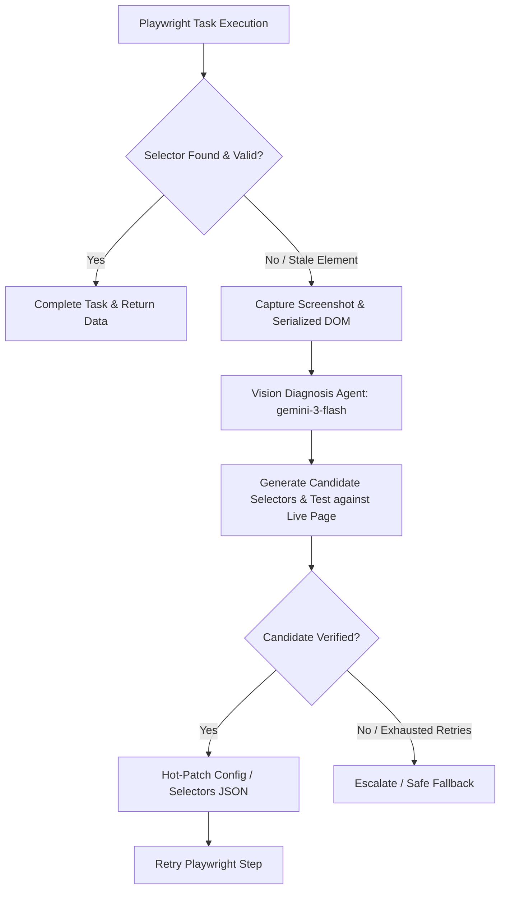
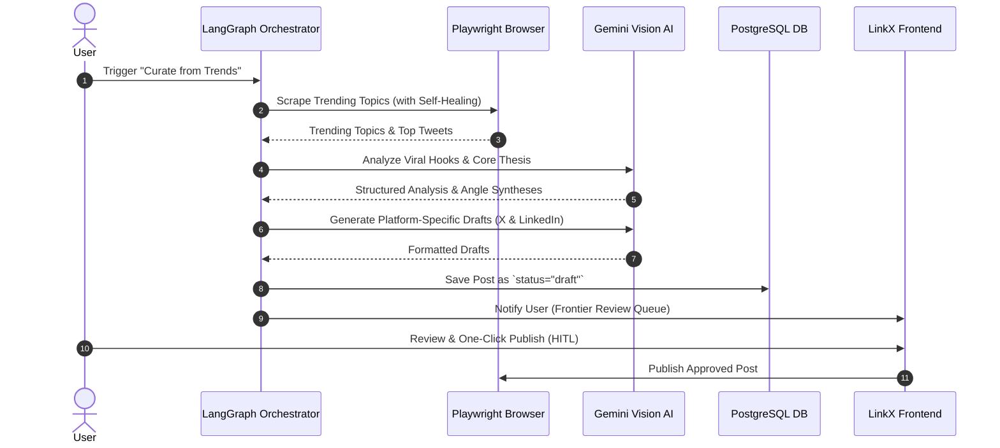

# Research Report: Self-Healing Agentic Content & Automation Pipeline

**Author**: LinkX Core Architecture Team
**Date**: August 18, 2026
**Status**: Approved Research & Technical Specification

---

## 1. Executive Summary & Objective

LinkX relies on deterministic browser automation (`rebrowser-playwright`) for X.com publishing and trending content extraction. However, dynamic frontend updates by social platforms frequently break CSS/XPath selectors, causing silent failures or broken scraping loops.

With **CLIProxyAPI** providing high-throughput OpenAI-compatible access to frontier multimodal models (`gemini-3-flash`, `gemini-3.1-pro-preview`, `claude-sonnet-4-6`), LinkX is evolving from brittle static scraping to a **Self-Healing Agentic Pipeline** orchestrated with **LangGraph** and **LangChain**.

### Core Pillars of the Architecture
1. **Path A (Production): Deterministic Stealth Engine with LangGraph Self-Healing**: Deterministic browser automation (`rebrowser-playwright`) handles daily trending scraping and X publishing (text & media). LangGraph orchestrates the self-healing supervisor: if selectors fail, it diagnoses the failure using DOM/screenshot context, tests candidate selectors live, and hot-patches `scrape_config.json` / `x_selectors.json`.
2. **Path B (Demonstration): Vision-Based Screenshot Scraping Pipeline**: A dedicated demonstration route showcasing pure visual scraping. Playwright navigates and captures page screenshots, and the Vision LLM (`gemini-3-flash`) extracts structured data and reports back in a chat/visual stream.
3. **Agentic Content Orchestration**: An automated pipeline that follows `Scrape -> Query -> Vision Analyze -> Draft`, presenting the structured drafts to the user for **Human-in-the-Loop (HITL) approval** before publishing.

---

## 2. CLIProxyAPI & Vision Capabilities Validation

### 2.1 Proxy Connectivity & Available Vision Models
* **Endpoint**: `http://127.0.0.1:8317/v1`
* **Authentication**: `OPENAI_API_COMPATIBLE_API_KEY` (configured in `.env.local` and `config.yaml`)
* **Active Models**:
  - `gemini-3-flash` (Primary): Fast (~1s), token-efficient, robust multimodal comprehension & structured output.
  - `gemini-3.1-flash-image`: Specialized for image OCR and visual analysis.
  - `gemini-3.1-pro-preview`: Extended context, high-reasoning fallback for deeply obfuscated DOM structures.

### 2.2 OpenAI Multimodal Schema Compliance
CLIProxyAPI accepts standard OpenAI `image_url` payloads with Base64 encoding:
```python
message = {
    "role": "user",
    "content": [
        {"type": "text", "text": "Locate the compose text box and tweet submit button."},
        {
            "type": "image_url",
            "image_url": {"url": f"data:image/png;base64,{screenshot_b64}"}
        }
    ]
}
```

---

## 3. Self-Healing Selector Engine: State Machine & Tools



### 3.1 Agent Toolbelt
The self-healing subagent is equipped with explicit Playwright inspection tools:
1. `take_screenshot(page_context)`: Captures full-page or scoped container screenshot.
2. `get_dom_snapshot(selector_scope)`: Extracts sanitized, pruned HTML containing relevant interactive elements, attributes (`data-testid`, `role`, `aria-label`), and hierarchical structure.
3. `test_selector(page, candidate_selector)`: Evaluates candidate selector count, visibility, and clickability on the live Playwright page.
4. `update_selector_config(config_path, key_path, new_selector)`: Safely updates `scrape_config.json` or `x_selectors.json` with the verified selector.

---

## 4. End-to-End Content Pipeline: Scrape to Draft



### 4.1 Safety & Human-in-the-Loop (HITL) Boundary
* **Scraping & Analysis**: Fully autonomous.
* **Draft Generation**: Fully autonomous.
* **Publishing**: **Strictly gated by human review**. Posts are saved in `draft` state with platform previews until the user explicitly clicks `Publish`.

---

## 5. Phased Implementation Roadmap & Issues

| Issue / Phase | Type | Scope | Dependencies |
| :--- | :--- | :--- | :--- |
| **Prerequisite: Centralize AI Settings in `ai_draft.py`** | `task` | Backend cleanup: Read AI credentials from `settings` instead of `os.environ` | None |
| **Phase 1: LangChain & LangGraph Foundation** | `task` | Install dependencies (`langchain-openai`, `langgraph`), setup base LLM client & structured schemas | Prerequisite |
| **Phase 2: Self-Healing Selector Engine (Read + Write)** | `task` | Implement diagnostic state machine, DOM/screenshot tools, config hot-patcher for `scrape_config.json` & `x_selectors.json` | Phase 1 |
| **Phase 3: LangGraph Content Pipeline (Scrape -> Draft)** | `task` | Build `scrape -> analyze -> draft` agentic graph with Postgres persistence | Phase 2 |
| **Phase 4: Agent Showcase & Diagnostic Route UI** | `prototype` | Frontend route `/approach/agent` showing live graph execution, self-healing logs, and draft reviews | Phase 3 |
