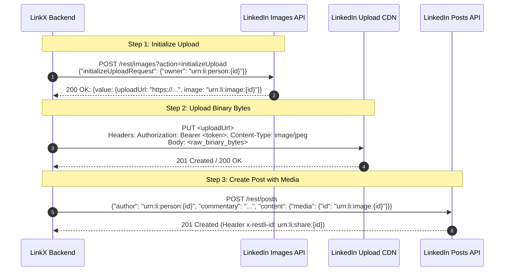

# Research Report: Media-Supported Social Posting & Dynamic Character Gauges (LinkedIn API + X Playwright Automation)

**Document Path:** `docs/research/media_supported_posting.md`
**Status:** Completed Investigation & Architecture Blueprint
**Authors:** LinkX Engineering Team
**Scope:** Multi-platform image posting across LinkedIn REST API & X (Twitter) Playwright browser automation, platform character limitations, and interactive circular character limit gauges.

---

## Executive Summary

LinkX is expanding its dual-channel publishing capabilities from text-only posts to rich media (image-supported) posts across both supported platforms:
1. **LinkedIn Profile/Organization Publishing:** Handled via LinkedIn's official **REST API (`rest/images` and `rest/posts`)** using OAuth 2.0 (`w_member_social`).
2. **X (Twitter) Publishing:** Handled via stealth headless browser automation using **`rebrowser-playwright` with `EvasionMouse` behavioral simulation**, bypassing X API tier paywalls.

This research specifies the end-to-end technical requirements, platform character constraints, circular character limit progress components, image upload protocols, and full-stack implementation details.

---

## 1. Platform Constraints & Character Limitation Matrix

Each social platform enforces strict character limits, media file size caps, and supported image MIME types.

| Platform | Max Character Limit | Media Format Support | Max Image Size | Character Warning Threshold | Over-Limit Behavior |
|---|---|---|---|---|---|
| **X (Twitter)** | **280 characters** | JPG, PNG, GIF, WebP | **5 MB** | 260 chars (20 remaining) | Hard-block post; circular gauge turns red with negative counter |
| **LinkedIn** | **3,000 characters** | JPG, PNG, GIF | **8 MB** | 2,900 chars (100 remaining) | Hard-block post; circular gauge turns red with negative counter |
| **Both (LinkX Mode)** | **280 characters** *(strictest constraint)* | JPG, PNG, GIF (intersection) | **5 MB** *(strictest cap)* | 260 chars (20 remaining) | Enforces 280-char cap to guarantee dual delivery |

---

## 2. Dynamic Circular Character Limit Gauge (`CharacterLimitCircle.tsx`)

Following native X (Twitter) composer design patterns, LinkX introduces a dynamic SVG circular progress ring positioned next to the composer action buttons.

```
┌────────────────────────────────────────────────────────────────────────────────────────┐
│ What's happening?                                                                      │
│ "Excited to share our new release with rich media support..."                          │
│                                                                                        │
│ ┌──────────────────────────────────────────────┐                                       │
│ │ [📷 Image Thumbnail Preview] [✕ Remove]       │                                       │
│ └──────────────────────────────────────────────┘                                       │
│ ────────────────────────────────────────────────────────────────────────────────────── │
│ [ 📅 Schedule ] [ 📷 Media ]                     [ ◯ Progress ]  [ Save ]  [ Post ]   │
└────────────────────────────────────────────────────────────────────────────────────────┘
```

### 2.1 SVG Progress Math & Component Specification

* **Radius ($r$):** `10px` (or `12px`)
* **Circumference ($C$):** $2 \pi r \approx 62.83\text{px}$
* **Progress Percentage ($P$):**
  $$P = \min\left(100, \frac{\text{contentLength}}{\text{maxLimit}} \times 100\right)$$
* **Stroke Dash Offset:**
  $$\text{strokeDashoffset} = C \times \left(1 - \frac{P}{100}\right)$$

### 2.2 Visual States & Transitions

```mermaid
stateDiagram-v2
    [*] --> NormalState : 0 <= length < (limit - 20)
    NormalState --> WarningState : (limit - 20) <= length <= limit
    WarningState --> NormalState : length < (limit - 20)
    WarningState --> ExceededState : length > limit
    ExceededState --> WarningState : length <= limit

    state NormalState {
        description: "Subtle primary ring (stroke-primary / stroke-blue-500). No numbers."
    }
    state WarningState {
        description: "Amber ring (stroke-amber-500). Displays remaining number in center or next to ring."
    }
    state ExceededState {
        description: "Red ring (stroke-destructive). Displays negative count (-N). Post button disabled."
    }
```

1. **Normal State ($< 80\%$ or $> 20$ chars remaining):**
   - Background track: `stroke-muted/40`
   - Active ring: `stroke-primary` (or platform accent: `#1d9bf0` for X, `#0a66c2` for LinkedIn).
   - Center: Empty (no text clutter).
2. **Warning State ($\le 20$ chars remaining for X, $\le 100$ for LinkedIn):**
   - Active ring: `stroke-amber-500` / `#eab308`
   - Numeric indicator: Shows remaining characters (e.g., `18`, `17`, ...).
3. **Exceeded State ($> \text{maxLimit}$):**
   - Active ring: `stroke-destructive` / `#ef4444`
   - Numeric indicator: Shows negative count in bold red (e.g., `-6`).
   - Action buttons (`Post`, `Schedule`) become disabled.

---

## 3. LinkedIn REST API Media Integration

### 3.1 3-Step Upload Protocol



#### Step 1: Initialize Image Upload
* **Endpoint:** `POST https://api.linkedin.com/rest/images?action=initializeUpload`
* **Request Body:**
  ```json
  {
    "initializeUploadRequest": {
      "owner": "urn:li:person:abcdef1234"
    }
  }
  ```
* **Response (HTTP 200):**
  ```json
  {
    "value": {
      "uploadUrlExpiresAt": 1770987654000,
      "uploadUrl": "https://www.linkedin.com/dms-uploads/cup-ap-southeast-1/C5622AQG.../uploaded-image",
      "image": "urn:li:image:D5622AQG78..."
    }
  }
  ```

#### Step 2: Upload Binary Image Data
* **Endpoint:** `<uploadUrl>` (from Step 1)
* **Method:** `PUT`
* **Headers:** `Authorization: Bearer {access_token}`, `Content-Type: image/jpeg`
* **Body:** Raw binary bytes of the image file.

#### Step 3: Create Post with Media URN
* **Endpoint:** `POST https://api.linkedin.com/rest/posts`
* **Request Body:**
  ```json
  {
    "author": "urn:li:person:abcdef1234",
    "commentary": "Excited to share this technical architecture diagram! #Engineering #SystemDesign",
    "visibility": "PUBLIC",
    "distribution": {
      "feedDistribution": "MAIN_FEED",
      "targetEntities": [],
      "thirdPartyDistributionChannels": []
    },
    "content": {
      "media": {
        "id": "urn:li:image:D5622AQG78...",
        "title": "Architecture Diagram"
      }
    },
    "lifecycleState": "PUBLISHED"
  }
  ```

---

## 4. X (Twitter) Playwright Automation Media Upload

### 4.1 DOM Locators & Injection
* **File Input Selector:** `input[data-testid="fileInput"]`
* **Post Text Input Selector:** `[data-testid="tweetTextarea_0"]`
* **Attachment Preview Container:** `[data-testid="attachments"]`
* **Upload Progress Indicator:** `[role="progressbar"]`
* **Remove Attachment Button:** `[data-testid="removeMedia"]`

### 4.2 Playwright Synchronization Sequence
1. **Focus & Type Post Text:** Type content via `EvasionMouse.human_type(selector=post_input, text=content)`.
2. **Inject File Path:** Execute `await page.locator('input[data-testid="fileInput"]').set_input_files(image_path)`.
3. **Wait for DOM Attachment:**
   ```python
   await page.wait_for_selector(
       '[data-testid="attachments"] img, [data-testid="mediaDraft"]',
       state="visible",
       timeout=15000,
   )
   ```
4. **Ensure Upload Completion:** Await detachment of `[role="progressbar"]`:
   ```python
   try:
       await page.wait_for_selector('[role="progressbar"]', state="detached", timeout=10000)
   except PlaywrightTimeoutError:
       pass
   ```
5. **Intercept `CreateTweet` GraphQL Endpoint & Click Post:**
   ```python
   async with page.expect_response(
       lambda resp: "graphql" in resp.url and "CreateTweet" in resp.url and resp.request.method == "POST",
       timeout=20000,
   ) as response_info:
       await mouse.human_click(selector=self.selectors["compose"]["post_button"])

   response = await response_info.value
   ```

---

## 5. Sub-Issues & Implementation Roadmap

```
Epic: Media-Supported Social Publishing & Character Gauges (Issue #77)
 ├── Subissue 1 (#73): Media Pipeline: Backend Asset Storage & Upload Endpoint
 ├── Subissue 2 (#74): LinkedIn Media Integration: 3-Step Image Upload via REST API
 ├── Subissue 3 (#75): X Browser Automation: Playwright Media Attachment & Synchronization
 └── Subissue 4 (#76): Frontend Media Upload, Circular Character Gauge & Live Previews
```

### 📋 Subissue 1 (#73): Backend Media Storage Pipeline
- Mount `/static/uploads` via `StaticFiles(directory=settings.UPLOAD_DIR)`.
- Endpoint: `POST /api/v1/posts/media` (validates MIME: `image/jpeg`, `image/png`, `image/gif`, `image/webp` and size $\le 5\text{MB}$).
- Generates UUID filenames in `backend/uploads/` and returns URL `/static/uploads/{filename}`.

### 📋 Subissue 2 (#74): LinkedIn REST API Media Service
- Create `LinkedInMediaClient` in `backend/app/services/linkedin_posts.py`.
- Implements 3-step upload: initializeUpload $\rightarrow$ PUT binary payload $\rightarrow$ create post with `content.media.id`.

### 📋 Subissue 3 (#75): X Playwright Media Automation
- Add media selectors to `backend/app/services/browser/selectors/x_selectors.json`.
- Implement `XPostClient.create_media_post()` in `backend/app/services/x_posts.py` with `set_input_files()`, attachment wait, and `CreateTweet` GraphQL capture.

### 📋 Subissue 4 (#76): Frontend Media Upload & Circular Progress Ring
- Create `frontend/src/components/PostInput/CharacterLimitCircle.tsx`.
- Wire `ImageIcon` button and file picker in `PostInputBox.tsx` with thumbnail preview and remove button.
- Integrate `CharacterLimitCircle` next to action buttons in `PostActionBar.tsx` with platform-aware limits (X: 280, LinkedIn: 3000, Both: 280).
- Update `LinkedInPostPreview` and `XPostPreview` in `PostPreviewDialog.tsx` to render attached images.
