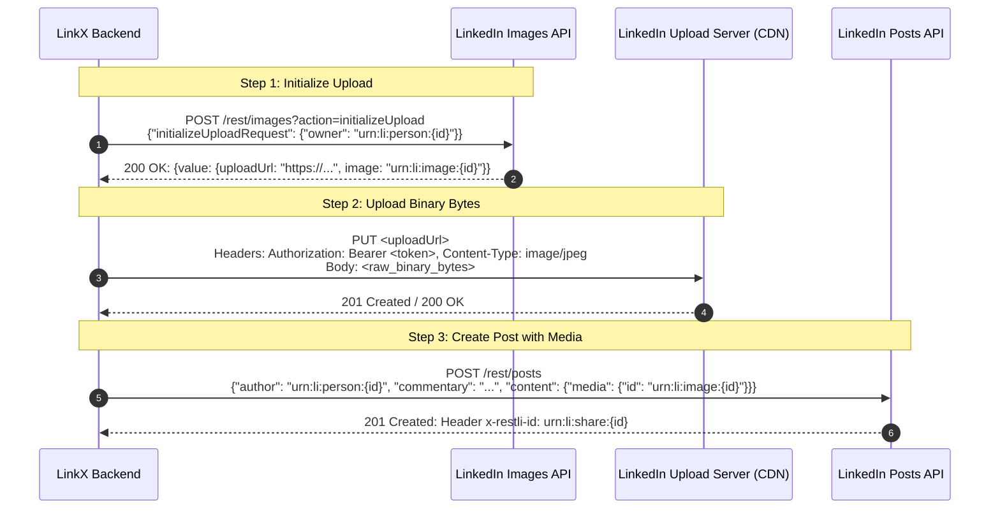

# Research Report: Media-Supported Social Posting (LinkedIn API + X Playwright Automation)

**Document Path:** `docs/research/media_supported_posting.md`
**Status:** Completed Investigation & Architecture Blueprint
**Authors:** LinkX Research & Engineering Team
**Scope:** Multi-platform image posting across LinkedIn REST API & X (Twitter) Playwright browser automation.

---

## Executive Summary

LinkX is expanding its dual-channel publishing capabilities from text-only posts to rich media (image-supported) posts across both supported platforms:
1. **LinkedIn Profile/Organization Publishing:** Handled via LinkedIn's official **REST API (`rest/images` and `rest/posts`)** using OAuth 2.0 (`w_member_social`).
2. **X (Twitter) Publishing:** Handled via stealth headless browser automation using **`rebrowser-playwright` with `EvasionMouse` behavioral simulation**, bypassing X API tier paywalls.

This research report specifies the end-to-end technical requirements, protocols, synchronization mechanics, error states, and component breakdowns needed to implement image uploads and publishing across the entire LinkX full-stack architecture.

---

# 1. LinkedIn REST API Media Integration

### 1.1 Specification & Protocol Overview
LinkedIn deprecates the legacy UGC (`/v2/ugcPosts` and `/v2/assets`) API in favor of the **Versioned REST API** (`/rest/images` and `/rest/posts`).

* **Base URL:** `https://api.linkedin.com/rest`
* **Protocol Version:** Restli 2.0.0 (`X-Restli-Protocol-Version: 2.0.0`)
* **API Version Header:** `LinkedIn-Version: 202511` (or latest `YYYYMM`)
* **Required OAuth Scopes:**
  * `w_member_social` (Personal profile posting)
  * `w_organization_social` (Company / Organization page posting)

### 1.2 Image Specifications & Limits
* **Supported MIME Types:** `image/jpeg`, `image/png`, `image/gif`, `image/webp`
* **Maximum File Size:** **8 MB**
* **Recommended Dimensions:**
  * Square: 1200 × 1200 px (1:1)
  * Landscape: 1200 × 627 px (1.91:1) or 1920 × 1080 px (16:9)
  * Portrait: 1080 × 1350 px (4:5)
* **Maximum Dimensions:** Up to 7680 × 4320 px (36 megapixels)

---

### 1.3 The 3-Step Upload Protocol



#### Step 1: Initialize Image Upload
* **Endpoint:** `POST https://api.linkedin.com/rest/images?action=initializeUpload`
* **Headers:**
  ```http
  Authorization: Bearer {access_token}
  LinkedIn-Version: 202511
  X-Restli-Protocol-Version: 2.0.0
  Content-Type: application/json
  ```
* **Request Body:**
  ```json
  {
    "initializeUploadRequest": {
      "owner": "urn:li:person:abcdef1234"
    }
  }
  ```
* **Response Body (HTTP 200):**
  ```json
  {
    "value": {
      "uploadUrlExpiresAt": 1770987654000,
      "uploadUrl": "https://www.linkedin.com/dms-uploads/cup-ap-southeast-1/C5622AQG.../uploaded-image",
      "image": "urn:li:image:D5622AQG78..."
    }
  }
  ```

#### Step 2: Upload Binary Image Data
* **Endpoint:** `<uploadUrl>` (from Step 1)
* **Method:** `PUT`
* **Headers:**
  ```http
  Authorization: Bearer {access_token}
  Content-Type: image/jpeg
  ```
* **Request Body:** Raw binary bytes of the image file (`open(file_path, "rb").read()`)
* **Expected Response:** `HTTP 201 Created` or `HTTP 200 OK`

#### Step 3: Create Post with Media Reference
* **Endpoint:** `POST https://api.linkedin.com/rest/posts`
* **Headers:**
  ```http
  Authorization: Bearer {access_token}
  LinkedIn-Version: 202511
  X-Restli-Protocol-Version: 2.0.0
  Content-Type: application/json
  ```
* **Request Body:**
  ```json
  {
    "author": "urn:li:person:abcdef1234",
    "commentary": "Excited to share our latest architecture updates! #LinkX #DevTools",
    "visibility": "PUBLIC",
    "distribution": {
      "feedDistribution": "MAIN_FEED",
      "targetEntities": [],
      "thirdPartyDistributionChannels": []
    },
    "content": {
      "media": {
        "id": "urn:li:image:D5622AQG78...",
        "altText": "LinkX System Architecture Diagram"
      }
    },
    "lifecycleState": "PUBLISHED",
    "isReshareDisabledByAuthor": false
  }
  ```
* **Response:** Header `x-restli-id: urn:li:share:{post_id}` or response body `{"id": "urn:li:share:{post_id}"}`.

### 1.4 LinkedIn Error Handling & Failure Matrix
| Status Code | Error Reason | LinkX Handling | Retryable? |
|---|---|---|---|
| `400 Bad Request` | Invalid owner URN or malformed JSON | Log payload validation failure; reject to client | No |
| `401 Unauthorized` | Expired/revoked access token | Raise `linkedin_token_expired`, prompt user reconnection | No |
| `403 Forbidden` | Missing `w_member_social` or member restricted | Mark post `failed` with permission error | No |
| `413 Payload Too Large` | Image exceeds 8 MB limit | Catch in LinkX pre-validation before sending | No |
| `429 Too Many Requests` | LinkedIn rate limit exceeded | Calculate exponential backoff, schedule retry | **Yes** |
| `500/502/503/504` | LinkedIn internal gateway error | Increment `retry_count`, schedule retry via state machine | **Yes** |

---

# 2. X (Twitter) Playwright Automation Media Upload

### 2.1 DOM Locators & Composer Structure
In X's web composer (`https://x.com/home` or `/compose/post`), media uploads are handled via an invisible `<input type="file">` tag present in the composer DOM tree:

* **File Input Selector:** `input[data-testid="fileInput"]`
* **Accept Attributes:** `image/jpeg,image/png,image/webp,image/gif,video/mp4,video/quicktime`
* **Post Text Input Selector:** `[data-testid="tweetTextarea_0"], .public-DraftEditor-content`
* **Post Button Selector:** `[data-testid="tweetButtonInline"], [data-testid="tweetButton"]`
* **Attachment Preview Container:** `[data-testid="attachments"], [data-testid="mediaDraft"], [aria-label="Media"]`
* **Remove Attached Media Button:** `[data-testid="removeMedia"], [aria-label="Remove media"]`
* **Upload Progress Indicator:** `[role="progressbar"], div[data-testid="attachments"] [aria-label="Loading..."]`

```
┌────────────────────────────────────────────────────────────┐
│  X Composer DOM                                            │
│                                                            │
│  [ data-testid="tweetTextarea_0" ]                         │
│  "LinkX media update..."                                   │
│                                                            │
│  ┌──────────────────────────────────────────────────────┐  │
│  │ [ data-testid="attachments" ]                        │  │
│  │  ┌─────────────────────────┐  [X (removeMedia)]      │  │
│  │  │  Preview           │                         │  │
│  │  └─────────────────────────┘                         │  │
│  └──────────────────────────────────────────────────────┘  │
│                                                            │
│  <input type="file" data-testid="fileInput" hidden />      │
│  [ImageIcon] [GIF] [Poll] [Emoji]      [ Post Button ]     │
└────────────────────────────────────────────────────────────┘
```

### 2.2 Upload Trigger Method: Programmatic File Injection
Interacting with OS-native file dialogs in headless automation is brittle. Playwright's `locator.set_input_files()` bypasses OS dialogs cleanly and safely attaches the file:

```python
file_input = page.locator('input[data-testid="fileInput"]')
await file_input.set_input_files(image_path)
```

### 2.3 Upload Completion & Synchronization Strategy
Uploading an image to X triggers an asynchronous upload to `upload.twitter.com/i/media/upload.json`. The automation flow must adhere to the following deterministic synchronization sequence:

1. **Focus & Type Post Text:** Type content via `EvasionMouse.human_type(selector=post_input, text=content)`.
2. **Inject File Path:** Execute `await page.locator('input[data-testid="fileInput"]').set_input_files(image_path)`.
3. **Wait for DOM Attachment:** Await visibility of `[data-testid="attachments"]` with a timeout of 15 seconds:
   ```python
   await page.wait_for_selector(
       '[data-testid="attachments"] img, [data-testid="mediaDraft"]',
       state="visible",
       timeout=15000,
   )
   ```
4. **Ensure Upload Progress Completion:** If a progress bar (`[role="progressbar"]`) appears, await its detachment:
   ```python
   try:
       await page.wait_for_selector('[role="progressbar"]', state="detached", timeout=10000)
   except PlaywrightTimeoutError:
       pass  # Progress bar may have already detached quickly
   ```
5. **Verify Post Button Enabled:** Ensure `[data-testid="tweetButtonInline"]` does not have `aria-disabled="true"` or `disabled`.
6. **Simulate Human Pause:** Run `await random_delay(min_sec=1.5, max_sec=3.0)` to mimic user visual verification.
7. **Intercept `CreateTweet` GraphQL Endpoint & Click Post:**
   ```python
   async with page.expect_response(
       lambda resp: "graphql" in resp.url and "CreateTweet" in resp.url and resp.request.method == "POST",
       timeout=20000,
   ) as response_info:
       await mouse.human_click(selector=self.selectors["compose"]["post_button"])

   response = await response_info.value
   ```

### 2.4 X Automation Error Matrix & Edge Cases
| Failure Scenario | DOM / Network Symptom | Mitigation & Recovery Strategy |
|---|---|---|
| Unsupported Image Format | File input fails or toast popup "File format not supported" | Pre-validate MIME types (`JPG`, `PNG`, `GIF`, `WebP`) in FastAPI before sending to Playwright |
| File Size Limit Exceeded (>5MB photo) | Upload fails or toast popup appears | Pre-validate file size (≤ 5MB) on upload endpoint |
| Upload Network Timeout | `[data-testid="attachments"]` fails to appear within 15s | Raise `XPostError(code="x_media_upload_timeout", retryable=True)` |
| Post Button Remains Disabled | Post text > 280 chars or media upload still processing | Raise `PostButtonDisabledError` with diagnostic details |
| Security Checkpoint Triggered | Navigation redirected to `/account/access` or checkpoint | Detect via sentinel check; mark session flagged (`x_session_flagged`) |

---

# 3. LinkX Architecture & Issue Structure Breakdown

Below is the **Wayfinder Issue Structure Breakdown** for the Media-Supported Social Posting milestone.

```
Epic: Media Support for Multi-Platform Publishing (LinkedIn + X)
 ├── Subissue 1: Backend Storage & Image Asset Pipeline
 ├── Subissue 2: LinkedIn API Media Publisher Service
 ├── Subissue 3: X Playwright Media Automation
 ├── Subissue 4: Unified Publishing Engine
 └── Subissue 5: Frontend Media Attachment UI
```

---

## 📋 Subissue 1: Backend Storage & Image Asset Pipeline

**Goal:** Create a robust, secure local and cloud-ready file storage system for uploaded media assets with validation and static serving.

### Tasks:
1. **Directory & Storage Configuration:**
   - Create storage directory at `backend/uploads/` (mounted into Docker backend container).
   - Configure `UPLOAD_DIR` in `backend/app/core/config.py`.
   - Mount static file router in `backend/app/main.py`: `app.mount("/static/uploads", StaticFiles(directory=settings.UPLOAD_DIR), name="uploads")`.
2. **Media Upload API Endpoint:**
   - Create `POST /api/v1/posts/media` in `backend/app/api/routes/posts.py` (or `media.py`).
   - Validate file MIME types against `ALLOWED_IMAGE_TYPES = {"image/jpeg", "image/png", "image/gif", "image/webp"}`.
   - Validate maximum file size (limit: 5MB for unified cross-platform compatibility).
   - Generate unique file names using `uuid.uuid4()` + sanitized extension to prevent path traversal.
   - Store metadata (file name, size, MIME type, local path, public URL).
   - Return `MediaPublic` schema: `{ "url": "/static/uploads/uuid.jpg", "file_name": "uuid.jpg", "size": 123456, "mime_type": "image/jpeg" }`.
3. **Storage Cleanup Service:**
   - Add utility to prune unreferenced media files older than 48 hours.

---

## 📋 Subissue 2: LinkedIn API Media Publisher Service

**Goal:** Implement `LinkedInMediaClient` / extend `LinkedInPostClient` with the complete 3-step image upload and publication pipeline.

### Tasks:
1. **Extend `backend/app/services/linkedin_posts.py`:**
   - Add method `initialize_image_upload(user_id, person_id) -> tuple[str, str]`:
     - Calls `POST /rest/images?action=initializeUpload`.
     - Extracts `uploadUrl` and `image` URN (`urn:li:image:...`).
   - Add method `upload_image_binary(upload_url, access_token, file_bytes, mime_type)`:
     - Sends `PUT <uploadUrl>` with raw binary stream and `Content-Type: mime_type`.
     - Validates HTTP 200/201 response.
   - Add method `create_image_post(user_id, linkedin_person_id, content, image_path_or_bytes, alt_text="") -> str`:
     - Executes Step 1 -> Step 2 -> Step 3.
     - Formats `POST /rest/posts` payload with `content.media = {"id": image_urn, "altText": alt_text}`.
     - Returns LinkedIn Post URN (`urn:li:share:...`).
2. **Unit & Integration Tests:**
   - Mock `httpx.AsyncClient` calls to simulate successful and failed 3-step flows.
   - Verify proper error codes (`linkedin_media_init_failed`, `linkedin_media_upload_failed`, `linkedin_publish_failed`).

---

## 📋 Subissue 3: X Playwright Media Automation

**Goal:** Extend `XPostClient` and browser actions to attach and publish images seamlessly within the stealth browser session.

### Tasks:
1. **Update Selector Repository (`backend/app/services/browser/selectors/x_selectors.json`):**
   ```json
   "compose": {
     "post_input": "[data-testid=\"tweetTextarea_0\"], .public-DraftEditor-content",
     "post_button": "[data-testid=\"tweetButtonInline\"], [data-testid=\"tweetButton\"]",
     "file_input": "input[data-testid=\"fileInput\"]",
     "media_preview": "[data-testid=\"attachments\"], [data-testid=\"mediaDraft\"]",
     "remove_media_button": "[data-testid=\"removeMedia\"], [aria-label=\"Remove media\"]"
   }
   ```
2. **Update `backend/app/services/x_posts.py`:**
   - Add `create_media_post(*, user_id: str, content: str, image_path: str) -> str`.
   - Update `_type_and_publish` to accept optional `image_path: str | None = None`.
   - Implement `_attach_media_and_wait(page, mouse, image_path)`:
     - Check file existence on disk.
     - Call `page.locator(file_input_selector).set_input_files(image_path)`.
     - Await attachment preview locator `[data-testid="attachments"]` with timeout.
     - Await detachment of `[role="progressbar"]`.
     - Perform human pause before triggering publish.
   - Intercept and validate GraphQL `CreateTweet` response.

---

## 📋 Subissue 4: Unified Publishing Engine

**Goal:** Upgrade `backend/app/services/publishing.py` to seamlessly orchestrate text and image posts across `linkedin`, `x`, and dual `linkx`/`all` modes.

### Tasks:
1. **Local Path Resolution:**
   - Implement `_resolve_media_path(image_url: str) -> Path | None` to translate public URLs (`/static/uploads/...`) to local filesystem paths inside the container.
2. **Update Platform Dispatchers:**
   - Update `_publish_linkedin`: If `post.image_url` is present, invoke `create_image_post()`; otherwise invoke `create_text_post()`.
   - Update `_publish_x`: If `post.image_url` is present, pass resolved local `image_path` to `create_media_post()`; otherwise invoke `create_text_post()`.
   - Update `_publish_all`: Publish to LinkedIn with media, publish to X with media, combine external IDs (`linkedin:{li_id},x:{x_id}`).
3. **State Machine & Retry Robustness:**
   - Ensure transient upload network failures mark post as `failed` with `retryable=True` and exponential retry backoff.

---

## 📋 Subissue 5: Frontend Media Attachment UI

**Goal:** Implement intuitive file selection, drag-and-drop, thumbnail previews, upload progress, and preview rendering in the post creation workflow.

### Tasks:
1. **Update `frontend/src/components/PostInput/PostActionBar.tsx`:**
   - Wire the existing Image button (`ImageIcon`) to trigger an invisible `<input type="file" accept="image/png,image/jpeg,image/gif,image/webp" />`.
2. **Update `frontend/src/components/PostInput/PostInputBox.tsx`:**
   - Add Drag & Drop target area to the composer box.
   - Display image preview container with:
     - Image thumbnail with aspect-ratio containment.
     - File name and size indicator.
     - Close / Remove (`X`) button to clear attached image.
     - Loading spinner while the image is uploading to backend storage.
3. **Update `frontend/src/components/PostInput/usePostForm.ts`:**
   - Add state: `imageFile: File | null`, `imageUrl: string | null`, `isUploadingMedia: boolean`.
   - Add mutation `uploadMediaMutation` that posts `FormData` to `/api/v1/posts/media`.
   - Include `image_url` in the `createNewPost` request body.
4. **Update Post Previews (`LinkedInPostPreview.tsx` & `XPostPreview.tsx`):**
   - Render the attached image in the live preview dialog according to platform-native aspect ratios and styling.

---

# 4. Milestone Context & Strategic Roadmap

```
┌─────────────────────────────────────────────────────────────┐
│  Phase 0 / Phase 1: Pure Deterministic Posting (Current)    │
│                                                             │
│  [ Text-Only Posts ] ───► [ Media-Supported Posts ]         │
│  • LinkedIn REST API       • LinkedIn Images API            │
│  • X Playwright Stealth    • X File Injection & Attach      │
│  • Dual LinkX Mode         • Local Asset Pipeline           │
└──────────────────────────────┬──────────────────────────────┘
                               │ Prerequisite Foundation
                               ▼
┌─────────────────────────────────────────────────────────────┐
│  Phase 2: AI-Powered Autonomous Curation (Next Milestone)   │
│                                                             │
│  • Trend Discovery (Scraping X Trends via browser-use)      │
│  • AI Content Generation (LangGraph + LiteLLM Multi-Agent)  │
│  • Image Generation / Selection Pipeline                    │
│  • Human-in-the-Loop Review Inbox                           │
└─────────────────────────────────────────────────────────────┘
```

Completing media-supported posting finishes the **core deterministic execution layer** (Milestones M3/M4 in `docs/ROADMAP.md`). With both text and media posting solidly operational and tested, the AI orchestration layer (LangGraph, LiteLLM, trending topics curation) can directly target these stable publishing primitives without platform-level friction.
