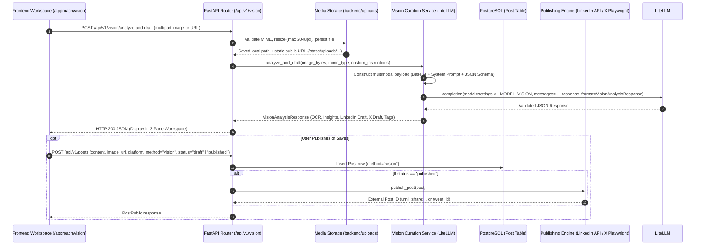

# Research Report & Architecture Blueprint: Multimodal Vision & OCR AI Pipeline (Issue #70)

**Document Path:** `docs/research/multimodal_vision_ocr_pipeline.md`
**Status:** Completed Investigation & Architecture Specification
**Scope:** Pillar 3 — Multimodal Vision & OCR AI Curation in LinkX (Visual Ingestion → OCR & Context Extraction → Dual Platform LinkedIn & X Post Synthesis → 1-Click Publishing).

---

## Executive Summary

LinkX is introducing **Pillar 3: Multimodal Vision & OCR AI Curation**, expanding its content creation capabilities from text-only prompt workflows to high-fidelity visual comprehension and derivative post curation.

Visual artifacts—such as **market/financial charts, system architecture diagrams, tweet/social screenshots, infographics, and technical memes**—contain dense data, context, and viral potential that traditional text prompts cannot easily express.

This research establishes the technical architecture, prompt strategies, API contract, and frontend workspace UI (`/approach/vision`) required to:
1. Accept an image (via drag-and-drop upload, clipboard paste, image URL, or sample presets).
2. Execute multimodal OCR text extraction and semantic scene comprehension.
3. Extract key data points, trends, quotes, and takeaways as structured insights.
4. Synthesize 2 platform-tailored post drafts:
   - **LinkedIn Draft**: Professional, data-driven narrative with structured formatting, bold hook, key takeaways, and relevant camelCase hashtags.
   - **X (Twitter) Draft**: Punchy take with key stats, high-engagement hook, character limit awareness (≤ 280 chars), and 1-2 sharp hashtags/cashtags.
5. Provide a responsive workspace with side-by-side editing, live native post previews (`LinkedInPostPreview` / `XPostPreview`), and direct 1-click publishing or draft persistence with `method="vision"`.

---

## 1. Multimodal Model Evaluation & Provider Matrix

LinkX leverages **LiteLLM** to provide vendor-agnostic access to multimodal vision models.

| Multimodal Provider / Model | LiteLLM Model ID | OCR & Visual Reasoning Quality | Speed (Latency) | Cost / Limits | Recommended Use Case |
|---|---|---|---|---|---|
| **Google Gemini 2.0 Flash** *(Default)* | `gemini/gemini-2.0-flash` | ⭐⭐⭐⭐⭐ (Exceptional on charts, diagrams & dense OCR) | ⚡ ~1.2s - 2.0s | **Free Tier:** 1,500 req/day (Google AI Studio) | **Default choice for all users** (Zero cost, ultra fast, 1M context) |
| **OpenAI GPT-4o** | `gpt-4o` | ⭐⭐⭐⭐⭐ (High precision structured JSON compliance) | ⏱️ ~2.5s - 4.0s | $2.50 / 1M input tokens | Enterprise / high-reliability JSON schema compliance |
| **OpenAI GPT-4o-mini** | `gpt-4o-mini` | ⭐⭐⭐⭐ (Good OCR, strong basic reasoning) | ⚡ ~1.5s - 2.5s | $0.15 / 1M input tokens | Budget API usage |
| **Anthropic Claude 3.5 Sonnet** | `anthropic/claude-3-5-sonnet-20241022` | ⭐⭐⭐⭐⭐ (Nuanced tone, outstanding prose & diagrams) | ⏱️ ~3.0s - 5.0s | $3.00 / 1M input tokens | Premium copywriting & nuanced technical breakdown |
| **Local Ollama (LLaVA / Qwen2-VL)** | `ollama/qwen2-vl` or `ollama/llama3.2-vision` | ⭐⭐⭐ (Fair OCR, basic scene understanding) | ⏱️ Dependent on local GPU (4-10s) | Free / 100% Offline | Self-hosted, air-gapped, privacy-sensitive environments |

### Key Architectural Choice: Base64 vs URL Payloads
LiteLLM accepts both public URLs and data URIs. Because LinkX is self-hosted and supports local development (`http://localhost:8000`), images uploaded locally may not be accessible over the public internet. Therefore, the backend converts uploaded images to **base64 data URIs (`data:{mime_type};base64,{b64_str}`)** when dispatching to LiteLLM, guaranteeing universal compatibility across all providers and environments.

---

## 2. End-to-End System Pipeline & Architecture



---

## 3. Prompt Engineering & Structured Output Schemas

### 3.1 Pydantic Output Schema

```python
from typing import Literal
from pydantic import BaseModel, Field


class ExtractedInsight(BaseModel):
    category: Literal[
        "data_point", "trend", "quote", "takeaway", "humor_context"
    ] = Field(description="Type of insight extracted from the visual.")
    text: str = Field(
        description="Clear, concise description of the data point or insight."
    )
    confidence: float | None = Field(
        default=None, description="Confidence score from 0.0 to 1.0."
    )


class VisionAnalysisResponse(BaseModel):
    image_url: str | None = Field(
        default=None, description="Stored static URL of the image."
    )
    image_type: Literal[
        "chart",
        "diagram",
        "tweet_screenshot",
        "infographic",
        "meme",
        "other",
    ] = Field(description="Detected visual genre.")
    ocr_text: str = Field(
        description="Full, verbatim OCR transcription of all visible text in the image."
    )
    summary: str = Field(
        description="2-3 sentence executive summary explaining what this image depicts and why it matters."
    )
    key_insights: list[ExtractedInsight] = Field(
        description="Key statistics, data series, architecture components, or narrative points."
    )
    suggested_tags: list[str] = Field(
        description="3 to 6 high-relevance topic tags without hash symbol."
    )
    linkedin_draft: str = Field(
        description="Complete LinkedIn post draft formatted with strong hook, structured bullet points, analytical takeaway, question for discussion, and 3-5 camelCase hashtags."
    )
    x_draft: str = Field(
        description="Complete X (Twitter) post draft crafted for maximum engagement, high-impact punchy hook, concise stat callout, under 280 characters, and 1-2 focused hashtags."
    )
```

---

## 4. Implementation Roadmap & Subissues Breakdown

```
Epic: Pillar 3 — Multimodal Vision & OCR AI Pipeline (Issue #70)
 ├── Subissue 1: Backend Multimodal Vision Service & LiteLLM Integration
 ├── Subissue 2: Vision API Route, Request/Response Schemas & Static Storage
 ├── Subissue 3: Prompt Engineering, Structured JSON Validation & Pytest Suite
 ├── Subissue 4: Frontend Vision Workspace UI (/approach/vision) & Dropzone
 └── Subissue 5: Live Previews, Sample Gallery, Client Generation & E2E Verification
```
