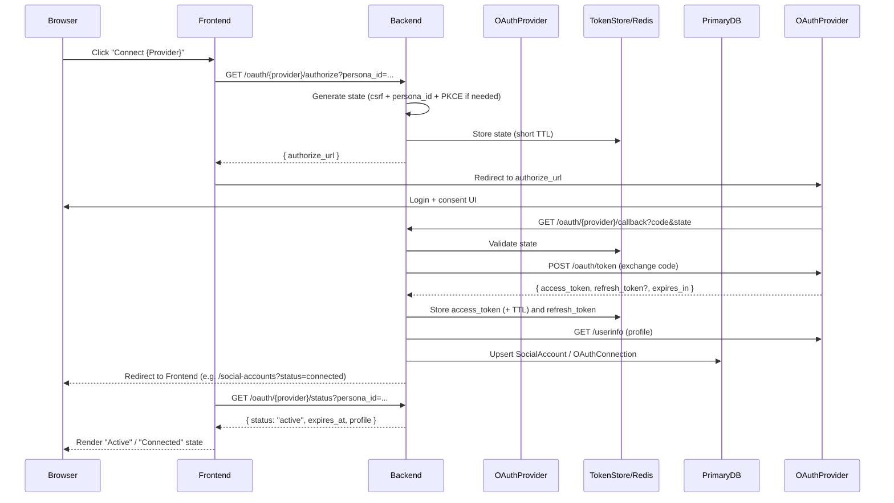
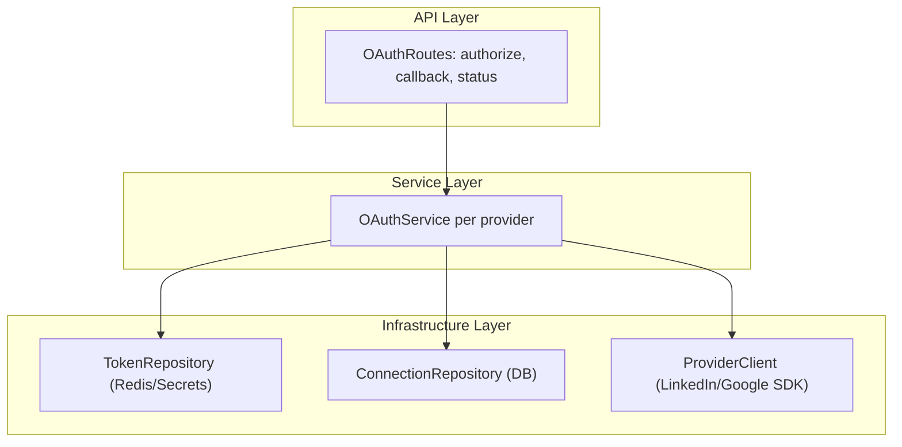
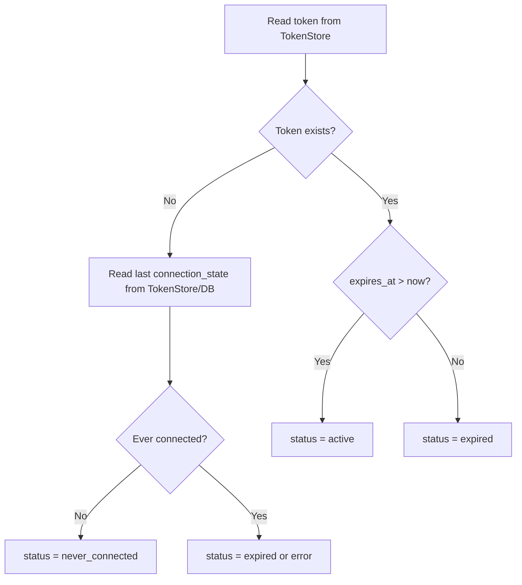
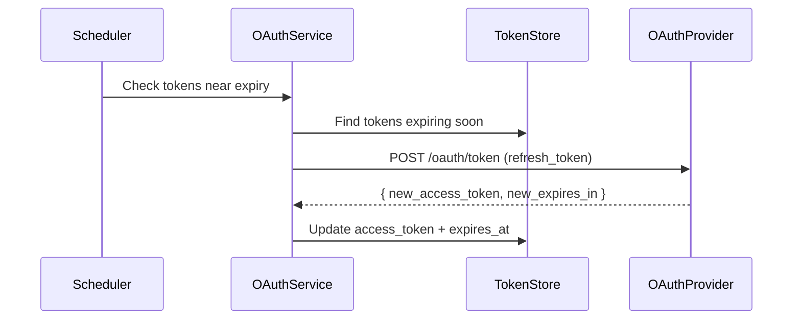

## OAuth Architecture & Patterns for Production Systems

This document describes **industry-standard building blocks** for OAuth-based integrations (such as LinkedIn), why you use them, and the **most common coding patterns** for a production-ready implementation. It is provider-agnostic (applies to LinkedIn, Google, etc.) and assumes a modern web stack similar to LinkX (FastAPI backend + React frontend).

---

### 1. Core Tech Stack Components (What You Need & Why)

- **Backend API server (e.g. FastAPI, Django, Express, Spring)**
  - **Why**: Acts as the **confidential client** in OAuth terms. Holds the OAuth client secret, performs authorization code exchange, stores tokens, and calls provider APIs.
  - **Key responsibilities**:
    - Expose `/oauth/{provider}/authorize` and `/oauth/{provider}/callback` endpoints.
    - Perform token exchange and refresh.
    - Store/rotate tokens and manage persona connections.
    - Enforce business rules (who can connect, scopes, rate limits).

- **Frontend SPA / Web client (e.g. React, Next.js, Vue)**
  - **Why**: Provides the UX—“Connect”, “Active”, “Expired”, “Reconnect”—and drives the user through the OAuth consent flow.
  - **Key responsibilities**:
    - Initiate OAuth by calling backend `/oauth/{provider}/authorize?persona_id=...`, then redirecting the browser to the provider.
    - Display connection state (connected / expired / error) and surface actions (connect, reconnect, disconnect).
    - Never store provider client secrets or long-lived tokens.

- **Primary database (e.g. PostgreSQL, MySQL)**
  - **Why**: Long-term, authoritative record of which persona is connected to which provider accounts (with team access handled separately).
  - **Typical data**:
    - `persona_id`
    - `provider` (`"linkedin"`, `"google"`, …)
    - `external_user_id` (e.g. LinkedIn person URN)
    - Profile metadata: name, email, avatar URL
    - Auditing timestamps: first connected, last updated, last used
  - **Pattern**: `social_accounts` or `oauth_connections` table, updated whenever profile info changes.

- **Token store (e.g. Redis, encrypted DB field, HashiCorp Vault)**
  - **Why**: Secure storage for **sensitive OAuth tokens** (access & refresh). Needs fast access and strict security.
  - **Options**:
    - **Redis**: Great for short-lived access tokens with TTL; can pair with DB for durable metadata.
    - **Encrypted DB columns**: Store tokens directly in Postgres with application-level or KMS-backed encryption.
    - **Secrets manager** (Vault, AWS Secrets Manager, GCP Secret Manager): For very strict environments.
  - **Best practice**: Short-lived access tokens in Redis with TTL; longer-lived refresh tokens in encrypted DB or secret store.

- **Background job runner / scheduler (e.g. Celery, RQ, Sidekiq, Resque, APScheduler, Kubernetes CronJobs)**
  - **Why**: Offload token refresh and provider API calls from request/response paths.
  - **Use cases**:
    - Periodically refresh tokens before they expire.
    - Run backfill / sync jobs (e.g., fetching analytics).
    - Retry failed provider calls with backoff.

- **Message queue / event bus (optional but common) (e.g. Redis Streams, RabbitMQ, Kafka, SQS)**
  - **Why**: Decouple “persona connected account” or “token expired” events from the rest of the system.
  - **Use cases**:
    - Publish `oauth.connected`, `oauth.expired`, `oauth.disconnected` events for analytics, auditing, or other services.

- **Observability stack (e.g. OpenTelemetry + Prometheus + Grafana, DataDog, Sentry)**
  - **Why**: OAuth flows fail in many real-world ways (user cancels, provider down, config mismatch). You need **tracing, logging, and metrics**.
  - **What to track**:
    - Rate of successful vs failed authorizations per provider.
    - Token refresh success/failure.
    - Latency and error rates of provider APIs.

- **Configuration & secrets management (e.g. .env + Docker secrets + KMS)**
  - **Why**: Securely manage `CLIENT_ID`, `CLIENT_SECRET`, redirect URIs, scopes, and per-environment config.
  - **Best practices**:
    - Never commit secrets to git.
    - Different apps per environment (dev, staging, prod) with separate credentials.

---

### 2. Industry-Standard OAuth Flow (Authorization Code with PKCE)

The **Authorization Code grant with PKCE** is the most widely used flow for web apps (and mobile). The high-level sequence:



Key properties:

- **State parameter** protects against CSRF, stored server-side with a short TTL; it also carries `persona_id` to bind the connection.
- **Authorization code** exchanged server-side, never in the front-end.
- **Access token** is short-lived; **refresh token** (if supported) is longer-lived.
- **Connection status** is computed server-side and exposed via a dedicated `/status` endpoint.

---

### 3. Coding Patterns: How to Structure the Code

The most widely used pattern for OAuth in modern backend apps is a **layered (or “service + repository”) architecture** with clearly separated concerns:

1. **Route/Controller layer** – handles HTTP, validation, and mapping to services.
2. **Service layer** – encapsulates OAuth flows and business rules.
3. **Repository / gateway layer** – handles persistence (DB, Redis, provider HTTP clients).

#### 3.1. Backend Layering Pattern



- **API Layer (`routes`)**
  - `GET /oauth/{provider}/authorize`: calls `OAuthService.start_authorization(user, provider, persona_id)`.
  - `GET /oauth/{provider}/callback`: calls `OAuthService.handle_callback(query_params)`.
  - `GET /oauth/{provider}/status`: calls `OAuthService.get_status(user, provider, persona_id)`.

- **Service Layer**
  - **Single responsibility**: implement OAuth flows and connection status logic.
  - Handles:
    - `state` generation and validation.
    - Code → token exchange and error handling.
    - Profile fetching and mapping.
    - Calling `TokenRepository` + `ConnectionRepository`.

- **Infrastructure Layer**
  - **TokenRepository**: read/write access + refresh tokens to secure store (Redis / DB).
  - **ConnectionRepository**: upsert and query `SocialAccount`/`OAuthConnection` records.
  - **ProviderClient**: HTTP client for provider APIs, fully isolated behind a clean interface.

Access control note: connect/disconnect actions require persona role (Owner/Admin); Member can view status only.

This pattern makes it easy to:

- Swap providers (add `GoogleOAuthService` alongside `LinkedInOAuthService`).
- Test each piece in isolation (mock repositories and provider clients).
- Evolve storage (e.g., move tokens from Redis to Vault) without touching route logic.

#### 3.2. Connection Status Pattern

Rather than having the frontend guess from booleans, use a **canonical status enum** on the backend:

- `never_connected`
- `active`
- `expired`
- `error`
- (optional) `revoked` or `disconnected`

Backend status computation (conceptually):



Frontend then consumes `/oauth/{provider}/status?persona_id=...`:

```json
{
  "status": "active",
  "expires_at": 1738900000,
  "profile": {
    "display_name": "Jane Doe",
    "email": "jane@example.com",
    "avatar_url": "https://..."
  }
}
```

and renders consistent **Connect / Active / Expired / Error** states.

---

### 4. Token Management & Refresh Strategy

#### 4.1. Short-lived access tokens, long-lived refresh tokens

- **Access tokens**:
  - Short lifespan (minutes–hours).
  - Stored in Redis with **TTL** equal to `expires_in`.
  - Used for direct calls to provider APIs.

- **Refresh tokens**:
  - Much longer lifespan (days–months) or not available (some providers).
  - Stored in **encrypted form** in DB or secret manager.
  - Used to obtain new access tokens without user re-consent.

#### 4.2. Background refresh pattern



Benefits:

- Users stay connected without manual “Reconnect” every time a token expires.
- Your UI can still surface “Active until {date}” and “Will refresh automatically”.

If the provider does **not** support refresh tokens (or you intentionally skip them), you:

- Rely on **re-auth (Reconnect)**.
- Use status enum + connection_state to distinguish “expired” vs “never connected”.

---

### 5. Security Best Practices for OAuth Implementations

- **Never expose client secrets** to the frontend or mobile JS; keep them on the backend only.
- **Use HTTPS** everywhere except localhost during development.
- **Validate `state`** on callback to prevent CSRF; store it server-side (Redis) with short TTL.
- **Validate redirect URIs**: only accept callbacks at known, configured URIs.
- **Encrypt tokens at rest** and restrict who can access token storage.
- **Log carefully**:
  - Never log full access/refresh tokens.
  - Log high-level statuses and correlation IDs for debugging.
- **Rate-limit authorization attempts** to avoid abuse.
- **Multi-tenant isolation**: make sure tokens and connection records are correctly scoped per persona (and not shared across teams without explicit persona access).

---

### 6. UX Patterns: Connect / Active / Expired / Error

Standard UX for professional OAuth integrations:

- **Connect**
  - Shown when `status = "never_connected"`.
  - CTA: primary “Connect [Provider]” button.
  - Explains what permissions will be requested and why.

- **Active**
  - Shown when `status = "active"`.
  - Badges like “Active” or “Connected”.
  - Optional subtitle: “Active until {date}” (based on `expires_at`).
  - CTA: “Manage” or “Reconnect” (if near expiry).

- **Expired**
  - Shown when `status = "expired"`.
  - Badge: “Expired”.
  - Subtitle: “Expired on {date}. Reconnect to continue posting.”
  - CTA: “Reconnect”.

- **Error**
  - Shown when `status = "error"`.
  - Badge: “Error”.
  - Helper text with non-technical description (e.g. “We couldn’t complete the connection. Check your LinkedIn app configuration or try again.”).
  - CTA: “Try again”.

These states are **driven exclusively by the backend’s `/oauth/{provider}/status`** endpoint, not by client guesses or query parameters.

---

### 7. Putting It All Together

In a production-ready OAuth system you typically have:

- A **backend** that owns secrets, performs code exchange, stores tokens, and exposes a clean status API.
- A **frontend** that only knows high-level connection states and drives the user through flow/UX.
- A **DB + token store** that separate durable metadata (who is connected) from sensitive, short-lived tokens.
- A **background scheduler** to refresh tokens (when supported) and keep connections alive.
- An **observability stack** to monitor failures and behavior.

This combination of tech stack and patterns is what most real-world SaaS products use to implement robust, auditable, and user-friendly OAuth integrations.

# References

[Byte Monk - OAuth 2.0](https://youtu.be/ZDuRmhLSLOY?si=uPcnvZ_UrFSbo5L4)
[API Authentication](https://youtu.be/xJA8tP74KD0?si=NSftxd33dKa5RbWx)
[Byte Monk - PKCE](https://youtu.be/5FrA0UzV1Aw?si=AbxBAPRt1wcMf8dh)
