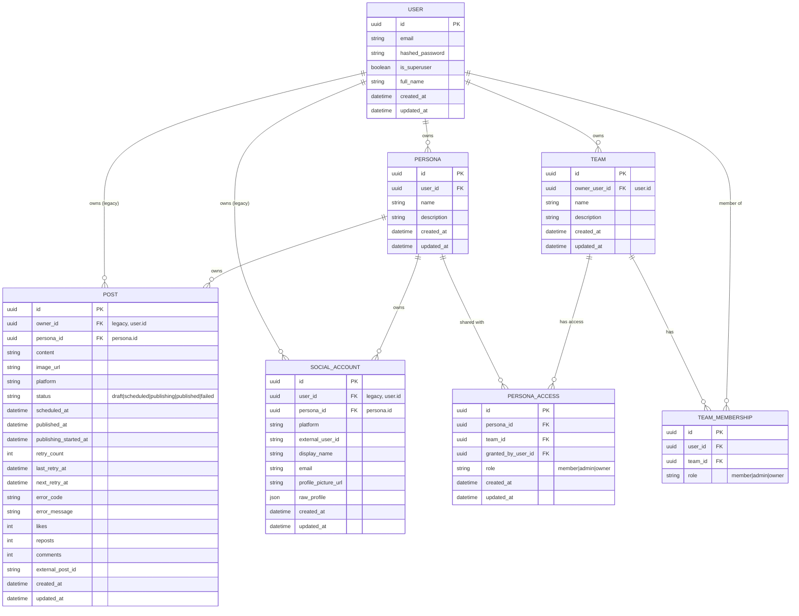

# LinkX Persona + Team Integration — Master Spec

## Overview
Personas represent real social identities (LinkedIn now, X/Twitter later, more platforms in future). Personas can be shared across teams with role-based access. This master spec defines the schema, APIs, permissions, posting/scheduling flows, and reliability requirements to enable persona + team collaboration.

This spec is implemented in phases:
- Phase 1: Persona + Team Access and persona-scoped OAuth
  - docs/specs/PERSONA_TEAM_PHASE1.md
- Phase 2: Persona-first Posts + UI
  - docs/specs/PERSONA_TEAM_PHASE2.md
- Phase 3: Scheduling, Reliability, Observability
  - docs/specs/PERSONA_TEAM_PHASE3.md

## Goals
- Make personas the primary ownership boundary for social accounts and posts.
- Enable team collaboration via persona sharing with explicit roles.
- Scope OAuth tokens and social connections to personas.
- Provide reliable scheduling/publishing with clear state transitions, retries, and observability.

## Non-Goals
- Multiple social accounts per persona per platform (defer).
- Direct user-level persona grants (team-only access in initial phases).
- New platforms beyond LinkedIn (defer).

## Key Principles
- **Persona-first**: All write operations require explicit `persona_id`. No default persona fallback at runtime.
- **Team-based access**: Persona access is granted to teams only (v1).
- **Persona-scoped OAuth**: Tokens and social accounts are bound to persona_id.
- **Legacy compatibility**: `owner_id`/`user_id` remain as legacy storage until fully removed, but are not used for access decisions after migration.

## Target Schema (Conceptual)



### Constraints and Indexes
- Unique: `social_account(persona_id, platform)`
- Unique: `team_membership(team_id, user_id)`
- Unique: `persona_access(persona_id, team_id)`
- Index: `post(persona_id, status, scheduled_at)`

## Roles and Permissions
| Role | Capabilities |
|------|--------------|
| Owner | Full control, share/unshare persona, delete persona, manage social accounts |
| Admin | Read + create + edit + schedule + publish posts for persona; manage social connections |
| Member | Read + draft posts only (no scheduling/publish) |

## Access Rules
1. Persona owner is the user who created it (primary).
2. Owner can share persona with a team using `PersonaAccess`.
3. Team members inherit the persona access role granted to that team.
4. Effective role = highest role across all teams a user belongs to for that persona.

## UX Requirements (High-Level)
- User must create/select a persona before connecting a platform.
- OAuth flow carries persona_id; connection is bound to that persona.
- Posts UI is always in a persona context (list + composer).
- Role-based gating:
  - Owner/Admin can publish and schedule.
  - Member can draft only.

## API Surface (High-Level)

### Personas
- GET /api/v1/personas
- POST /api/v1/personas
- GET /api/v1/personas/{id}
- PUT /api/v1/personas/{id}
- DELETE /api/v1/personas/{id}
- POST /api/v1/personas/{id}/share
- GET /api/v1/personas/{id}/access
- DELETE /api/v1/personas/{id}/access/{team_id}

### Teams
- GET /api/v1/teams
- POST /api/v1/teams
- GET /api/v1/teams/{id}
- PUT /api/v1/teams/{id}
- DELETE /api/v1/teams/{id}
- POST /api/v1/teams/{id}/members
- DELETE /api/v1/teams/{id}/members/{user_id}

### Posts (Persona-First)
- GET /api/v1/posts?persona_id=...
- POST /api/v1/posts {"persona_id": "...", ...}
- persona_id is required; missing returns 400.

### Social Accounts (Persona-Scoped)
- GET /api/v1/linkedin/status?persona_id=...
- OAuth callback binds SocialAccount and tokens to persona_id.

## Posting and Scheduling Reliability
### Error Contract
```json
{
  "error": "linkedin_publish_failed",
  "message": "LinkedIn API returned 429",
  "retryable": true,
  "details": {"platform": "linkedin", "status_code": 429},
  "trace_id": "..."
}
```

### Status Transitions
- draft -> scheduled -> publishing -> published
- draft -> publishing -> published
- scheduled -> failed
- publishing -> failed
- failed -> scheduled (manual retry only)

### Retry Rules
- Retry up to 3 times with exponential backoff for retryable errors.
- Non-retryable errors mark `failed` immediately.
- Persist retry_count, last_retry_at, next_retry_at, error_code, error_message.

### Idempotency
- If external_post_id is already set, publishing must no-op (avoid duplicates).

## Migration Strategy
1. Personas are backfilled for existing users (already done).
2. Phase 1 adds persona_access and persona-scoped OAuth.
3. Phase 2 enforces persona-first posts (no default persona fallback).
4. Phase 3 adds scheduling reliability and observability.
5. Remove legacy owner_id references only after Phase 2/3 adoption.

## Testing Checklist (Master)
- Persona CRUD and access checks
- Team CRUD + membership
- Persona sharing and role enforcement
- Persona-scoped LinkedIn connection
- Persona-first posts (create/list/update/delete)
- Role-based publish restrictions
- Scheduling reliability + retries (Phase 3)

## Implementation Phases
- Phase 1: Persona + Team Access, persona-scoped OAuth, minimal UI
- Phase 2: Persona-first posts + UI
- Phase 3: Reliability, retries, observability

Refer to the phase specs for detailed implementation steps and acceptance criteria.
