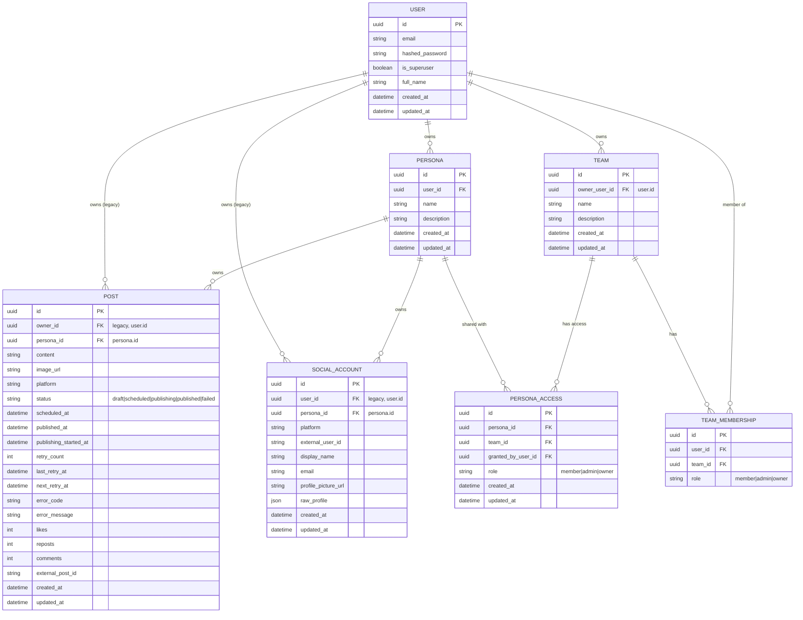

# LinkX Persona + Team Integration — Complete Specification

## Overview
Personas represent real social identities (LinkedIn now, X/Twitter later, more platforms in future). Personas can be shared across teams with role-based access. This comprehensive spec defines the schema, APIs, permissions, posting/scheduling flows, and reliability requirements to enable persona + team collaboration.

This spec is implemented in three phases, detailed below:
- **Phase 1**: Persona + Team Access and persona-scoped OAuth
- **Phase 2**: Persona-first Posts + UI
- **Phase 3**: Scheduling, Reliability, Observability (includes pending scheduler roadmap)

## Goals
- Make personas the primary ownership boundary for social accounts and posts.
- Enable team collaboration via persona sharing with explicit roles.
- Scope OAuth tokens and social connections to personas.
- Provide reliable scheduling/publishing with clear state transitions, retries, and observability.

## Non-Goals
- Multiple social accounts per persona per platform (defer).
- Direct user-level persona grants (team-only access in initial phases).
- New platforms beyond LinkedIn (defer).

## Key Principles
- **Persona-first**: All write operations require explicit `persona_id`. No default persona fallback at runtime.
- **Team-based access**: Persona access is granted to teams only (v1).
- **Persona-scoped OAuth**: Tokens and social accounts are bound to persona_id.
- **Legacy compatibility**: `owner_id`/`user_id` remain as legacy storage until fully removed, but are not used for access decisions after migration.

## Target Schema (Conceptual)



### Constraints and Indexes
- Unique: `social_account(persona_id, platform)`
- Unique: `team_membership(team_id, user_id)`
- Unique: `persona_access(persona_id, team_id)`
- Index: `post(persona_id, status, scheduled_at)`

## Roles and Permissions
| Role | Capabilities |
|------|--------------|
| Owner | Full control, share/unshare persona, delete persona, manage social accounts |
| Admin | Read + create + edit + schedule + publish posts for persona; manage social connections |
| Member | Read + draft posts only (no scheduling/publish) |

## Access Rules
1. Persona owner is the user who created it (primary).
2. Owner can share persona with a team using `PersonaAccess`.
3. Team members inherit the persona access role granted to that team.
4. Effective role = highest role across all teams a user belongs to for that persona.

## UX Requirements (High-Level)
- User must create/select a persona before connecting a platform.
- OAuth flow carries persona_id; connection is bound to that persona.
- Posts UI is always in a persona context (list + composer).
- Role-based gating:
  - Owner/Admin can publish and schedule.
  - Member can draft only.

## API Surface (High-Level)

### Personas
- GET /api/v1/personas
- POST /api/v1/personas
- GET /api/v1/personas/{id}
- PUT /api/v1/personas/{id}
- DELETE /api/v1/personas/{id}
- POST /api/v1/personas/{id}/share
- GET /api/v1/personas/{id}/access
- DELETE /api/v1/personas/{id}/access/{team_id}

### Teams
- GET /api/v1/teams
- POST /api/v1/teams
- GET /api/v1/teams/{id}
- PUT /api/v1/teams/{id}
- DELETE /api/v1/teams/{id}
- POST /api/v1/teams/{id}/members
- DELETE /api/v1/teams/{id}/members/{user_id}

### Posts (Persona-First)
- GET /api/v1/posts?persona_id=...
- POST /api/v1/posts {"persona_id": "...", ...}
- persona_id is required; missing returns 400.

### Social Accounts (Persona-Scoped)
- GET /api/v1/linkedin/status?persona_id=...
- OAuth callback binds SocialAccount and tokens to persona_id.

## Posting and Scheduling Reliability
### Error Contract
```json
{
  "error": "linkedin_publish_failed",
  "message": "LinkedIn API returned 429",
  "retryable": true,
  "details": {"platform": "linkedin", "status_code": 429},
  "trace_id": "..."
}
```

### Status Transitions
- draft -> scheduled -> publishing -> published
- draft -> publishing -> published
- scheduled -> failed
- publishing -> failed
- failed -> scheduled (manual retry only)

### Retry Rules
- Retry up to 3 times with exponential backoff for retryable errors.
- Non-retryable errors mark `failed` immediately.
- Persist retry_count, last_retry_at, next_retry_at, error_code, error_message.

### Idempotency
- If external_post_id is already set, publishing must no-op (avoid duplicates).

## Migration Strategy
1. Personas are backfilled for existing users (already done).
2. Phase 1 adds persona_access and persona-scoped OAuth.
3. Phase 2 enforces persona-first posts (no default persona fallback).
4. Phase 3 adds scheduling reliability and observability.
5. Remove legacy owner_id references only after Phase 2/3 adoption.

## Testing Checklist (Master)
- Persona CRUD and access checks
- Team CRUD + membership
- Persona sharing and role enforcement
- Persona-scoped LinkedIn connection
- Persona-first posts (create/list/update/delete)
- Role-based publish restrictions
- Scheduling reliability + retries (Phase 3)

---

## Phase 1: Persona + Team CRUD & Sharing

### Summary
Phase 1 delivers persona-first identity and collaboration foundations without changing the post ownership model. The scope is:
- Persona CRUD
- Team CRUD + membership
- Persona sharing to teams with role-based access
- Persona-scoped LinkedIn OAuth and token storage
- Minimal UI flow to create/select persona and connect LinkedIn

Posts remain user-owned in Phase 1; persona-based post creation, scheduling, and reliability improvements are deferred to later phases.

### Phase 1 Goals
- Make personas a first-class, explicit identity for social connections.
- Enable team-based sharing of personas with clear role permissions.
- Scope LinkedIn OAuth tokens to persona to prevent cross-persona collisions.
- Provide minimal UI to create/select a persona and connect LinkedIn.

### Phase 1 Non-Goals
- Persona-based post creation and filtering.
- Scheduling/publishing reliability changes (retry, error contract, etc.).
- Direct user-level persona grants (team-only access in Phase 1).
- Multi-account per persona per platform.

### Phase 1 Definitions
- **Persona**: Content identity owned by a user.
- **Team**: Group of users for collaboration.
- **Persona Access**: A grant that shares a persona with a team plus role.
- **Roles**: owner, admin, member.

### Phase 1 Roles and Permissions

**Owner:**
- Full persona control: edit/delete persona, share/unshare, manage social accounts.

**Admin:**
- Read persona data and manage social connections for the persona.

**Member:**
- Read-only access to persona and related social account status.

**Rules:**
- Persona owner is always the creator user.
- Persona access is granted to teams only (no direct user grants in Phase 1).
- Effective role = highest role across all teams the user belongs to for that persona.

### Phase 1 Data Model Changes

#### New Table: persona_access

Fields:
- `id` (UUID PK)
- `persona_id` (FK persona.id, required)
- `team_id` (FK team.id, required)
- `role` (string enum: owner|admin|member)
- `granted_by_user_id` (FK user.id, required)
- `created_at`, `updated_at`

Constraints:
- Unique (persona_id, team_id)
- Index on persona_id and team_id

#### Existing Tables
- `social_account`: enforce unique (persona_id, platform)
- `team_membership`: enforce unique (team_id, user_id)

### Phase 1 API Surface

#### Personas
- `GET /api/v1/personas`
  - Returns personas owned by the user + personas shared with teams they belong to.
- `POST /api/v1/personas`
  - Creates a persona owned by the user.
- `GET /api/v1/personas/{id}`
  - Requires access (owner or via team share).
- `PUT /api/v1/personas/{id}`
  - Owner only.
- `DELETE /api/v1/personas/{id}`
  - Owner only.

#### Persona Sharing
- `POST /api/v1/personas/{id}/share`
  - Body: `{team_id, role}`
  - Owner only.
- `GET /api/v1/personas/{id}/access`
  - Owner only.
- `DELETE /api/v1/personas/{id}/access/{team_id}`
  - Owner only.

#### Teams
- `GET /api/v1/teams`
  - Teams where the user is a member.
- `POST /api/v1/teams`
  - Creates a team with current user as owner.
- `POST /api/v1/teams/{id}/members`
  - Body: `{user_id, role}`
  - Owner/admin only.
- `DELETE /api/v1/teams/{id}/members/{user_id}`
  - Owner/admin only. Owner cannot remove the last owner.

#### LinkedIn (Persona-scoped)
- `GET /api/v1/linkedin/status?persona_id=...`
  - Returns connection status for that persona.
- OAuth callback
  - Persona_id must be supplied via OAuth state.
  - SocialAccount is created/updated for the persona.
  - Tokens stored under persona scope.

### Phase 1 OAuth and Token Scoping
- OAuth state must include persona_id and CSRF token.
- Tokens stored under Redis key: `linkedin:token:{persona_id}`.
- SocialAccount is linked to persona_id; user_id is retained for legacy visibility.
- If persona_id is missing or invalid in OAuth state, callback returns 400.

### Phase 1 UI/UX
- Persona creation flow is required before LinkedIn connect.
- Persona selector is shown on the LinkedIn connection screen.
- Connect LinkedIn triggers OAuth with persona_id in state.
- Role-based UI gating for persona settings:
  - Owner: can share/unshare persona.
  - Admin: can connect/disconnect LinkedIn for that persona.
  - Member: view-only.

### Phase 1 Migration and Compatibility
- Existing personas already backfilled; no new data migration required in Phase 1 beyond persona_access table.
- Existing LinkedIn connections are user-scoped; users must reconnect per persona to attach tokens.
- Posts remain user-owned; no changes to post routes or filters in Phase 1.

### Phase 1 Error Handling
- Consistent 403 for insufficient permissions.
- Consistent 404 when resource is not found or not accessible.
- OAuth callback returns 400 for missing/invalid persona_id state.

### Phase 1 Observability
- Log OAuth success/failure with persona_id, user_id, and trace_id.
- Log persona share/unshare actions with persona_id, team_id, and user_id.

### Phase 1 Test Plan

**Unit tests:**
- Persona access resolution (owner/admin/member via team share).
- Team membership role enforcement.

**API tests:**
- Persona CRUD (owner permissions).
- Team CRUD + membership add/remove.
- Persona share/unshare.
- LinkedIn status scoped by persona.
- OAuth callback binds to persona.

**UI tests:**
- Create persona then connect LinkedIn.
- Attempt connect without persona (blocked).
- Role-based visibility of persona settings.

### Phase 1 Acceptance Criteria
- Users can create personas and teams, then share personas with teams.
- LinkedIn connection is persona-scoped and stored under persona token keys.
- Persona access is enforced for all persona and LinkedIn status endpoints.
- UI requires persona selection before connecting LinkedIn.
- Posts remain unchanged and continue to function in legacy user-owned mode.

---

## Phase 2: Persona-based Posts

### Summary
Phase 2 makes posts persona-first across API and UI. It enforces persona-based access for all post operations, requires persona_id in post requests, and updates the UI to operate within a persona context. Scheduling/publishing reliability changes are deferred to Phase 3.

### Phase 2 Goals
- Enforce persona-based access for all post reads and writes.
- Require explicit persona_id for post creation and listing.
- Update UI to select persona context and gate actions by role.

### Phase 2 Non-Goals
- Scheduling/publishing reliability changes (retry, error contract, state machine).
- New social platforms beyond LinkedIn.
- Multi-account per persona per platform.

### Phase 2 Roles and Permissions (Posts)

**Owner/Admin:**
- Create, edit, delete, and publish posts for the persona.

**Member:**
- Create and edit drafts only (no publish or schedule).

### Phase 2 API Contract

#### Posts
- `GET /api/v1/posts?persona_id=...`
  - persona_id is required; missing returns 400.
  - Returns posts for that persona only.
- `POST /api/v1/posts`
  - persona_id is required in body; missing returns 400.
  - Enforces persona access (owner/admin/member).
- `PUT /api/v1/posts/{id}`
  - Enforces persona access.
  - Member cannot change status to published.
- `DELETE /api/v1/posts/{id}`
  - Enforces persona access.
  - Member cannot delete posts if restricted by role (optional; enforce if needed).

#### LinkedIn Publish Path
- Social account lookup is persona-scoped.
- Tokens are persona-scoped (from Phase 1).
- If no persona-linked SocialAccount exists, return a controlled error.

### Phase 2 Data Model and CRUD Alignment
- Add persona_id to PostCreate and PostUpdate (required).
- PostPublic includes persona_id and uses it for access.
- CRUD filtering uses persona_id instead of owner_id.
- owner_id remains legacy storage only; not used for access or filtering.

### Phase 2 UI/UX
- Persona selector in post list and post composer.
- Posts list filters by selected persona.
- Composer requires persona selection before submit.
- Role-based gating:
  - Owner/Admin: publish actions available.
  - Member: publish controls hidden/disabled.

### Phase 2 Migration and Compatibility
- No default persona fallback. Missing persona_id yields 400.
- Legacy clients must be updated to pass persona_id.
- Existing owner_id data remains for compatibility but unused for access.

### Phase 2 Error Handling
- 400 for missing persona_id on posts endpoints.
- 403 for insufficient role permissions.
- 404 for posts not found or not accessible under persona.

### Phase 2 Observability
- Log post actions with persona_id and user_id:
  - create/update/delete/publish attempts.

### Phase 2 Test Plan

**API tests:**
- GET /posts requires persona_id and filters correctly.
- POST /posts rejects missing persona_id.
- Role-based publish restrictions enforced.

**Unit tests:**
- Persona access resolution for posts queries and updates.

**UI tests:**
- Persona selection required for compose.
- Role-based gating for publish controls.
- Posts list filtered by persona.

### Phase 2 Acceptance Criteria
- Posts API and UI are persona-scoped.
- Missing persona_id is rejected with clear errors.
- Members cannot publish or schedule posts.
- Owner/Admin can publish posts when LinkedIn is connected for that persona.

---

## Phase 3: Scheduling & Publishing Reliability

### Summary
Phase 3 delivers scheduling/publishing reliability for persona-scoped posts. It introduces a formal post state machine, retry rules, standardized error payloads, idempotency guarantees, and observability. UI surfaces new states and allows retries for authorized roles.

### Phase 3 Goals
- Add explicit post state transitions for scheduled/publishing flows.
- Implement retryable error handling with a consistent error contract.
- Ensure idempotent publishing to prevent duplicate posts.
- Improve observability with structured logs and metrics.

### Phase 3 Non-Goals
- New social platforms beyond LinkedIn.
- Multiple accounts per persona per platform.

### Phase 3 State Machine

#### Statuses
- `draft`
- `scheduled`
- `publishing`
- `published`
- `failed`

#### Allowed Transitions
- draft → scheduled
- draft → publishing
- scheduled → publishing
- publishing → published
- publishing → failed
- scheduled → failed
- failed → scheduled (manual retry only, admin/owner)

Invalid transitions return 400.

### Phase 3 Error Contract

All publish/schedule errors must return structured errors:

```json
{
  "error": "linkedin_publish_failed",
  "message": "LinkedIn API returned 429",
  "retryable": true,
  "details": {"platform": "linkedin", "status_code": 429},
  "trace_id": "..."
}
```

### Phase 3 Retry Policy
- Retryable errors are retried up to 3 times with exponential backoff.
- Non-retryable errors immediately mark the post as failed.
- Retry fields are persisted on the post:
  - `retry_count`
  - `last_retry_at`
  - `next_retry_at` (if scheduling a future retry)

### Phase 3 Scheduler Behavior

**The scheduler selects posts where:**
- status = scheduled
- scheduled_at <= now

**Process:**
1. Transitions status to publishing before attempting publish.
2. Idempotency: do not publish if external_post_id already exists.
3. On success: set external_post_id, published_at, status = published.
4. On retryable error: increment retry_count, set last_retry_at, set next_retry_at, keep status = scheduled.
5. On non-retryable error: set status = failed, store error_code/message.

### Phase 3 Schema Updates

Add the following fields to post table:
- `error_code` (string)
- `error_message` (string)
- `retry_count` (int, default 0)
- `last_retry_at` (timestamp)
- `next_retry_at` (timestamp, optional)
- `publishing_started_at` (timestamp)

**Indexes:**
- (persona_id, status, scheduled_at)

### Phase 3 Observability

**Structured logs for publish attempts and failures with:**
- post_id, persona_id, user_id, platform, status, trace_id

**Metrics:**
- publish_attempts_total
- publish_success_total
- publish_fail_total (by reason)
- publish_retry_total

### Phase 3 UI Changes
- Show new states: publishing, failed.
- Display error details on failed posts.
- Owner/admin can manually retry failed posts.
- Members cannot retry or publish.

### Phase 3 Test Plan

**Unit tests:**
- State transition validation
- Retry classification and counters
- Idempotent publish logic

**Integration tests:**
- Scheduler selects due posts
- Retryable errors reschedule with backoff
- Non-retryable errors mark failed

**UI tests:**
- Publishing and failed state display
- Retry button visibility (owner/admin only)
- Retry action updates state

### Phase 3 Assumptions
- Phase 1 persona access and Phase 2 persona-first posts are complete.
- Tokens are persona-scoped and SocialAccounts are persona-linked.

---

## Roadmap: Post Scheduler Implementation (Pending)

### Overview
The post scheduler is a background service that processes scheduled posts, transitions them through the state machine, and publishes them to social platforms. This is a **critical missing component** for Phase 3 that requires implementation before scheduling reliability is production-ready.

### Scheduler Service Requirements

**Core Functionality:**
1. Polls the database for posts with status='scheduled' and scheduled_at <= NOW
2. Transitions posts to status='publishing' before attempting to publish
3. Publishes to the appropriate social platform (LinkedIn, etc.)
4. Implements retry logic with exponential backoff for transient failures
5. Tracks retry attempts, timestamps, and error details
6. Updates post state atomically to prevent duplicate publishing

**Configuration:**
- SCHEDULER_POLL_INTERVAL: 30 seconds (configurable via .env)
- MAX_RETRIES: 3
- INITIAL_RETRY_DELAY: 60 seconds
- BACKOFF_MULTIPLIER: 2x

**Implementation Approach:**
- Use APScheduler for background job scheduling
- Alternative: Use Celery for distributed task queue (more robust)
- Ensure idempotency with external_post_id check

### Error Classification for Publishing

| Error | Retryable | Handling |
|-------|-----------|----------|
| 401 Unauthorized | No | Set status='failed', non-retryable |
| 429 Rate Limited | Yes | Keep status='scheduled', reschedule with backoff |
| 500 Server Error | Yes | Keep status='scheduled', reschedule with backoff |
| Network Timeout | Yes | Keep status='scheduled', reschedule with backoff |
| 400 Invalid Content | No | Set status='failed', non-retryable |

### Database Schema for Scheduler

**New Fields on post table:**
- `error_code` (VARCHAR(50), nullable): e.g., 'linkedin_rate_limited', 'network_timeout'
- `error_message` (TEXT, nullable): human-readable error description
- `retry_count` (INT, default 0): number of retry attempts
- `last_retry_at` (TIMESTAMP, nullable): when the last retry occurred
- `next_retry_at` (TIMESTAMP, nullable): when the next retry is scheduled
- `publishing_started_at` (TIMESTAMP, nullable): when publish attempt began

**Indexes:**
- (persona_id, status, scheduled_at) for scheduler queries
- (user_id, status) for user post listing

**Alembic Migration:**
```sql
ALTER TABLE post ADD COLUMN error_code VARCHAR(50);
ALTER TABLE post ADD COLUMN error_message TEXT;
ALTER TABLE post ADD COLUMN retry_count INT DEFAULT 0;
ALTER TABLE post ADD COLUMN last_retry_at TIMESTAMP;
ALTER TABLE post ADD COLUMN next_retry_at TIMESTAMP;
ALTER TABLE post ADD COLUMN publishing_started_at TIMESTAMP;

CREATE INDEX idx_post_persona_status_scheduled
ON post(persona_id, status, scheduled_at);
```

### Scheduler Configuration & Deployment

**Environment Variables:**
```
SCHEDULER_ENABLED=true
SCHEDULER_POLL_INTERVAL=30
SCHEDULER_MAX_RETRIES=3
SCHEDULER_INITIAL_RETRY_DELAY=60
SCHEDULER_BACKOFF_MULTIPLIER=2
SCHEDULER_USE_DISTRIBUTED_LOCK=true
```

**Distributed Lock (for multi-instance deployments):**
- When multiple backend instances run, scheduler acquires Redis lock before processing batch
- Lock has TTL of 2x poll interval (e.g., 60 seconds for 30s interval)
- Other instances skip scheduler iteration if lock is held
- This prevents publishing the same post twice

**Graceful Shutdown:**
- On SIGTERM:
  1. Stop accepting new scheduler tasks
  2. Complete any in-flight publish operations
  3. Release distributed lock
  4. Exit cleanly

### Retry Logic Implementation

**Retryable Error Handling:**
1. Keep status='scheduled' (or 'failed' with retry_at set)
2. Increment retry_count
3. Set last_retry_at = NOW
4. Calculate next_retry_at = NOW + (60 * 2^retry_count)
5. Continue normal scheduler loop (post will be retried)

**Non-Retryable Error Handling:**
1. Set status='failed'
2. Set error_code and error_message
3. User/admin can manually retry via UI (state='failed' → 'scheduled')
4. Do not automatically reschedule

**Maximum Retry Limit:**
- After MAX_RETRIES attempts (default 3):
  - Set status='failed'
  - Set error_code='max_retries_exceeded'
  - Stop automatic retries
  - User must manually resolve and retry

### Scheduler Logging & Metrics

**Structured Logs (JSON):**
```json
{
  "level": "info|warning|error",
  "timestamp": "2024-01-15T10:30:00Z",
  "trace_id": "...",
  "post_id": "...",
  "persona_id": "...",
  "user_id": "...",
  "event": "publish_attempt|publish_success|publish_failure",
  "platform": "linkedin",
  "retry_count": 1,
  "error_code": "rate_limited",
  "message": "LinkedIn API returned 429"
}
```

**Prometheus Metrics:**
- `linkx_publish_attempts_total` (counter)
- `linkx_publish_success_total` (counter)
- `linkx_publish_fail_total` (counter, by error_code)
- `linkx_publish_retry_total` (counter)
- `linkx_publish_duration_seconds` (histogram)

### UI for Scheduler Status

**Post State Display:**

| State | Display | Behavior |
|-------|---------|----------|
| draft | Gray badge "Draft" | Can edit, schedule, or publish |
| scheduled | Blue badge "Scheduled" | Shows scheduled time, can edit or cancel |
| publishing | Yellow badge with spinner "Publishing..." | Read-only, shows spinner |
| published | Green badge "Published" | Read-only, shows published time + LinkedIn link |
| failed | Red badge "Failed" | Shows error details, allows admin/owner to retry |

**Failed Post Details:**
- Show error_code and error_message
- Show retry_count and last_retry_at
- Show next_retry_at (if scheduled)
- 'Retry' button for owner/admin (hidden for members)
- On retry click: POST /api/v1/posts/{id}/retry

### Admin Dashboard for Scheduler

**Admin Endpoints:**

- `GET /api/v1/admin/scheduler/status`
  - Returns scheduler health and statistics

```json
{
  "is_running": true,
  "last_run_at": "2024-01-15T10:30:00Z",
  "next_run_at": "2024-01-15T10:30:30Z",
  "pending_posts_count": 5,
  "processing_posts_count": 1,
  "failed_posts_count": 2,
  "successful_publishes_count": 42
}
```

- `GET /api/v1/admin/scheduler/pending-posts`
  - Returns list of posts with status='scheduled' and scheduled_at <= NOW

- `GET /api/v1/admin/scheduler/failed-posts`
  - Returns list of posts with status='failed'

- `POST /api/v1/admin/scheduler/run-now`
  - Immediately runs scheduler (bypasses poll interval)
  - Response: `{ posts_processed: 3, success: 2, failed: 1 }`

- `GET /api/v1/admin/scheduler/metrics`
  - Returns scheduler metrics and performance data

### Integration Testing Strategy

**Test Scenarios:**

1. **Basic Publishing:**
   - Create persona with LinkedIn connected
   - Create post and schedule for 1 minute from now
   - Wait for scheduler to process
   - Verify post status='published' with external_post_id

2. **Retry on Transient Error:**
   - Mock LinkedIn API to return 429 on first attempt
   - Create and schedule post
   - Wait for scheduler (first attempt fails)
   - Verify retry_count=1, next_retry_at is set
   - Mock LinkedIn to return success on retry
   - Verify post is published after retry

3. **Max Retries:**
   - Mock LinkedIn API to always return 429
   - Create and schedule post
   - Wait for 3 scheduler attempts
   - Verify status='failed' after MAX_RETRIES

4. **Admin Retry:**
   - Have a failed post from above
   - Log in as admin
   - Click 'Retry' button on failed post
   - Verify state changes to 'scheduled'
   - Verify scheduler processes and publishes

5. **Batch Processing:**
   - Create 5 posts all scheduled for the same time
   - Wait for scheduler to process
   - Verify all 5 are in 'published' state

6. **Persona-scoped Tokens:**
   - Create 2 personas, each with LinkedIn connected
   - Create posts in each persona and schedule
   - Verify posts published to their respective accounts

7. **Missing/Expired Tokens:**
   - Create post and schedule it
   - Delete/expire LinkedIn token for persona
   - Wait for scheduler to process
   - Verify status='failed' with error_code='linkedin_unauthorized'

### Implementation Checklist

- [ ] Create Post model fields (error_code, error_message, retry_count, last_retry_at, next_retry_at, publishing_started_at)
- [ ] Create database migration (Alembic)
- [ ] Implement error classification logic
- [ ] Implement retry scheduling with exponential backoff
- [ ] Create scheduler service class (APScheduler or Celery)
- [ ] Implement distributed lock for multi-instance safety
- [ ] Add graceful shutdown handler
- [ ] Create structured logging for all publish attempts
- [ ] Add Prometheus metrics
- [ ] Implement POST /api/v1/posts/{id}/retry endpoint
- [ ] Update POST UI to show new states (publishing, failed)
- [ ] Add error details display on failed posts
- [ ] Create admin dashboard endpoints
- [ ] Write unit tests for state transitions
- [ ] Write integration tests for scheduler behavior
- [ ] Write UI tests for state display and retry actions
- [ ] Add monitoring/alerting for scheduler health
- [ ] Document scheduler configuration and deployment
- [ ] Performance test with high volume of scheduled posts

### Estimated Effort

- **Backend:** ~40 hours
  - Scheduler service implementation: 20h
  - Error handling and retry logic: 10h
  - Logging, metrics, observability: 5h
  - Tests and validation: 5h

- **Frontend:** ~15 hours
  - UI state display and badges: 5h
  - Error details and retry UI: 5h
  - Admin dashboard: 5h

- **DevOps:** ~5 hours
  - Configuration and environment setup: 2h
  - Monitoring and alerting: 2h
  - Deployment documentation: 1h

- **Total:** ~60 hours

### Dependencies

- APScheduler >= 3.10.0 (or Celery >= 5.3.0)
- Redis for distributed locks and token storage
- LinkedIn API v2 with proper error handling

---

## Summary

This comprehensive specification covers:

1. **Phase 1:** Persona and Team CRUD with role-based sharing and persona-scoped LinkedIn OAuth
2. **Phase 2:** Persona-first post creation and filtering with role-based access control
3. **Phase 3:** Post state machine with scheduling, publishing, and retry logic
4. **Roadmap:** Detailed implementation guide for the pending scheduler service

The roadmap section provides concrete implementation requirements, configuration details, error handling strategies, and an estimated 60-hour effort allocation for the scheduler implementation.
